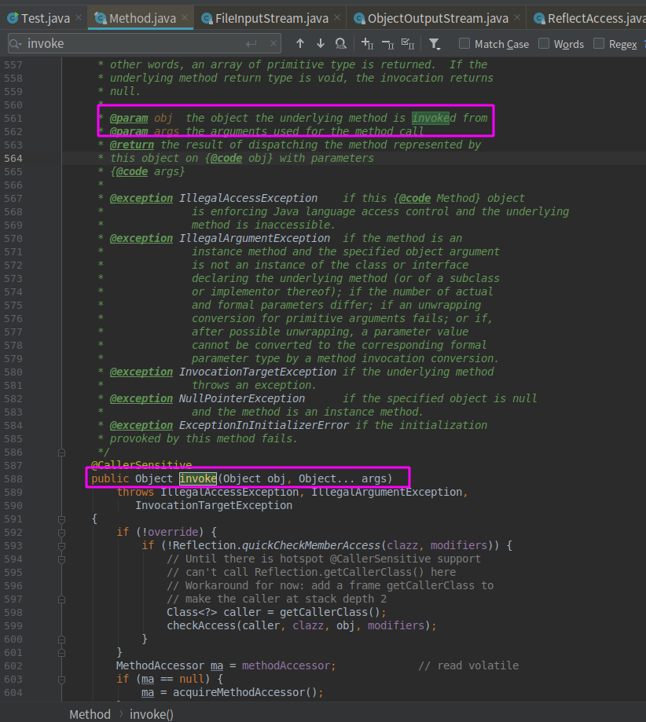
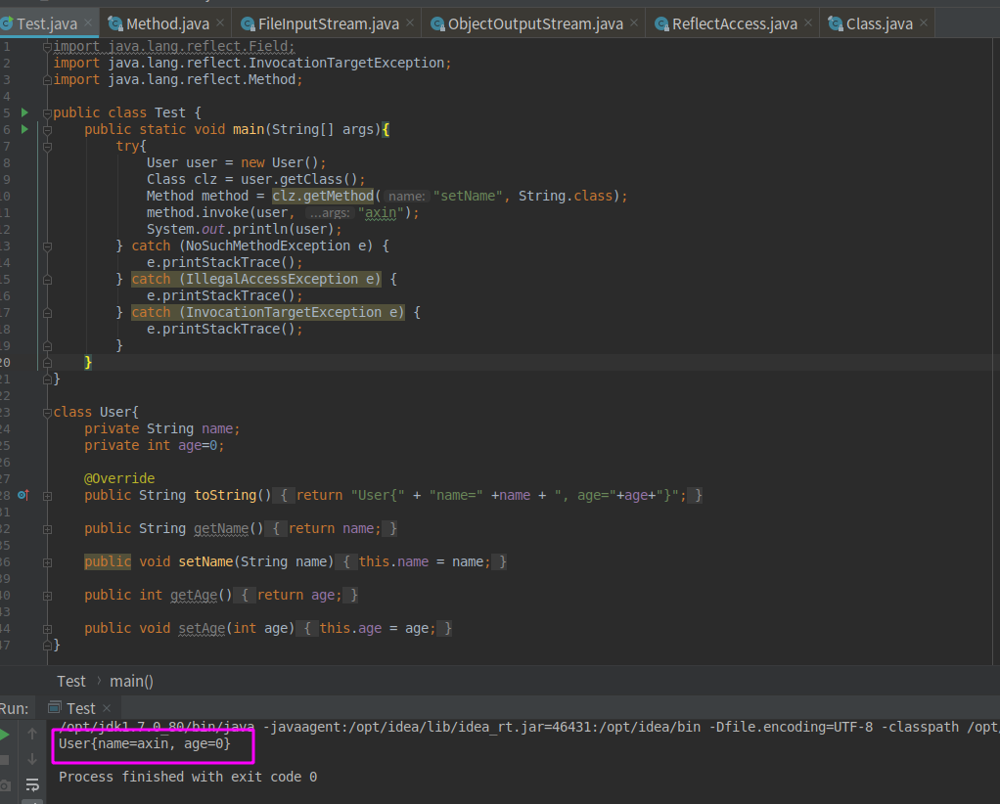

### 0x01 基本概念

Java反射机制是在运行状态时，对于任意一个类，都能够获取到这个类的所有属性和方法，对于任意一个对象，都能够调用它的任意一个方法和属性(包括私有的方法和属性)，这种动态获取的信息以及动态调用对象的方法的功能就称为java语言的反射机制。

java反射机制给漏洞利用提供了很多便利，我们可以在很多java漏洞的exp中看到它的影子，所以，学习java安全是绕不开它的。

### 0x02

前面我们知道了反射机制能够做什么，但是java具体是怎么实现这一点的呢？这几涉及到java中的几个类:Class、Constructor、Method、Field，有过面向对象编程经验的同学都知道，一个类一般是抽象出了某一类事物的特征，例如下面这个Person类就抽象出了一个人的特征，并实现了一些操作这些特征的方法：

```java
class Person{
    private String name;
    private int age;
    private  double  height;
    private double  weight;

    public String getName() {
        return name;
    }

    public void setName(String name) {
        this.name = name;
    }

    public int getAge() {
        return age;
    }

    public void setAge(int age) {
        this.age = age;
    }

    public double getHeight() {
        return height;
    }

    public void setHeight(double height) {
        this.height = height;
    }

    public double getWeight() {
        return weight;
    }

    public void setWeight(double weight) {
        this.weight = weight;
    }

    public void show(){
        System.out.println("xxxxxx");
    }
}
```

那么我们刚刚说的那几个和反射相关的类同样是这样的——Class类抽象出了java中类的特征并提供了一些方法，Constructor抽象出了java中所有的构造函数的特征以及提供一些方法....(最开始接触java安全的时候我就经常会被java的Class类型搞昏)

知道了这几个类之后，我们再回到怎么实现`调用一个对象的任意方法`这个问题上来，分三步走：

  1. 首先获得这个对象对应的Class类的实例
  2. 因为Class这个类存储着一个类的所有信息：属性、方法、构造函数....所以我们可以通过Class类的实例来获取你想要调用的那个方法
  3. 拿到了对应的方法过后，我们可以给这个方法传入对应的参数来调用它。

上面是一个大体的流程，现在我们来看一下用代码怎么实现这三个流程：

为了后续更好地阐述，我们以通过反射调用下面这个User类的setName()方法为例：

```java
class User{
    private String name;
    private int age;

    @Override
    public String toString(){
        return "User{" + "name=" +name + ", age="+age+"}";
    }

    public String getName() {
        return name;
    }

    public void setName(String name) {
        this.name = name;
    }

    public int getAge() {
        return age;
    }

    public void setAge(int age) {
        this.age = age;
    }
}
```

**1.获得User对象的Class类实例**

有三种方式获得Class类实例：
```
1.调用Class类的静态方法forName获取某个类的Class类实例：
Class clz = Class.forName("com.axin.User");

2.访问某个类的class属性，这个属性就存储着这个类对应的Class类的实例：
Class clz = com.axin.User.class;

3.调用某个对象的getClass()方法：
Class clz = (new User()).getClass();
```

**2.获取setName方法**

我们之前已经提到了Method这个类，java中所有的方法都是Method类型，所以我们通过反射机制获取到某个对象的方法也是Method类型的。通过Class对象获取某个方法：

```
clz.getMethod(方法名，这个方法的参数类型)

例：
Method method = clz.getMethod("setName", String.class);
```

**3.调用setName方法**

Method类中有一个invoke方法，就是用来调用特定方法的，用法如下：



第一个参数是调用该方法的对象，第二个参数是一个可变长参数，是这个方法的需要传入的参数，描述的不够直观，直接看代码：

```java
接着上文代码：
method.invoke((new User()), "axin");

或者

User user = new User();
method.invoke(user, "axin");
```

流程走完了，让我们来看看整体程序：



可以看到我们成功调用setName方法，并设置name为“axin”。


### 0x03

除了调用一个对象的任意方法，我们还可以获得某个对象对应的类名、所有的属性以及所有的方法名，由于这些内容在编写exp中使用较少，就不写在这里了。

