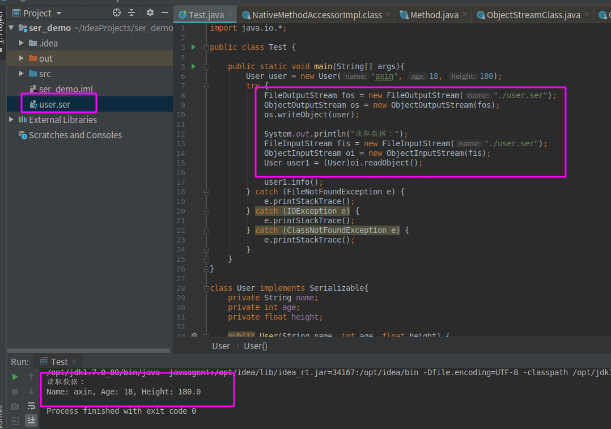
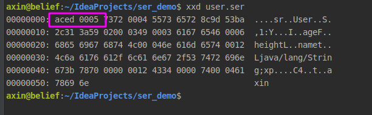
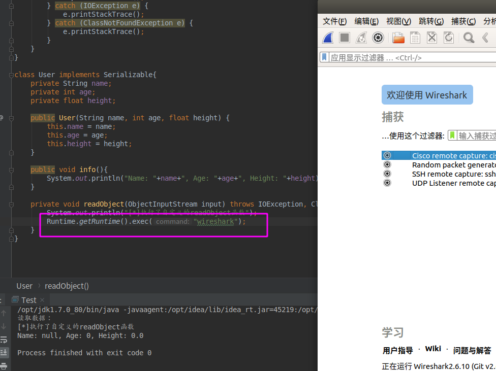

### 0x01 

- 什么是序列化与反序列化？
- 序列化与反序列化的关键函数？
- 反序列化过后的数据有啥特征?
- java反序列化漏洞与php反序列化漏洞的相似之处?

这一章，我们只需要搞清楚前面三个问题就行了，其实java反序列化漏洞的原理很简单，只是各个POP链比较复杂。我会很浅显的介绍一下java的序列化～

### 0x02

在我看来，java的序列化机制就是为了持久化存储某个对象或者在网络上传输某个对象。我们都知道，一旦jvm关闭，那么java中的对象也就销毁了，所以要想保存它，就需要把他转换为字节序列写到某个文件或是其它哪里。

序列化：把对象转换为字节序列
反序列化：吧字节序列转换为对象

### 0x03

一个类对象要想实现序列化，必须满足两个条件：

1、该类必须实现 java.io.Serializable 对象。

2、该类的所有属性必须是可序列化的。~~如果有一个属性不是可序列化的，则该属性必须注明是短暂的。~~(这个咱先不关注)

### 0x04 

要序列化一个对象，首先要创建OutputStream对象，再将其封装在一个ObjectOutputStream对象内，接着只需调用writeObject()即可将对象序列化，并将其发送给OutputStream（对象是基于字节的，因此要使用InputStream和OutputStream来继承层次结构）。

要反序列化出一个对象，需要将一个InputStream封装在ObjectInputStream内，然后调用readObject()即可。

看文字不够直观，咱们直接上代码（注意看注释）：

```java
import java.io.*;

public class Test {

    public static void main(String[] args){
        User user = new User("axin", 18, 180);
        try {
            // 创建一个FIleOutputStream
            FileOutputStream fos = new FileOutputStream("./user.ser");
            // 将这个FIleOutputStream封装到ObjectOutputStream中
            ObjectOutputStream os = new ObjectOutputStream(fos);
            // 调用writeObject方法，序列化对象到文件user.ser中
            os.writeObject(user);
            
            System.out.println("读取数据：");
            //  创建一个FIleInutputStream
            FileInputStream fis = new FileInputStream("./user.ser");
            // 将FileInputStream封装到ObjectInputStream中
            ObjectInputStream oi = new ObjectInputStream(fis);
            // 调用readObject从user.ser中反序列化出对象，还需要进行一下类型转换，默认是Object类型
            User user1 = (User)oi.readObject();
            
            user1.info();
        } catch (FileNotFoundException e) {
            e.printStackTrace();
        } catch (IOException e) {
            e.printStackTrace();
        } catch (ClassNotFoundException e) {
            e.printStackTrace();
        }
    }
}

class User implements Serializable{
    private String name;
    private int age;
    private float height;

    public User(String name, int age, float height) {
        this.name = name;
        this.age = age;
        this.height = height;
    }

    public void info(){
        System.out.println("Name: "+name+", Age: "+age+", Height: "+height);
    }

    // private void readObject(ObjectInputStream input) throws IOException, ClassNotFoundException{
    //     System.out.println("[*]执行了自定义的readObject函数");
    // }
}
```

程序执行过后会在当前目录下生成一个user.ser文件，并且反序列化过后会执行info方法，在终端上打印出User的信息：



可以看到按照预期执行了，成功生成了一个user.ser文件，这个文件里存放的就是反序列化过后的User类对象，我们看一下内容，这里借助一个linux下的小工具xxd查看内容：



xxd显示的结果，中间那一栏是文件的十六进制显示，最右边是字符显示。这里需要注意的特征值就是16进制显示时的前32位：

AC ED：STREAM_MAGIC，声明使用了序列化协议，**从这里可以判断保存的内容是否为序列化数据。** （这是在黑盒挖掘反序列化漏洞很重要的一个点）

00 05：STREAM_VERSION，序列化协议版本。

### 0x05

上面已经说完了序列化的基础了，大家也应该知道如何实现一个对象的序列化与反序列化了，那么，漏洞点到底在哪里呢?如果你了解php的反序列化，那么你应该知道php反序列化一个对象时会自动触发`__weakup`、`__destruct`这些函数，如果这些函数当中有一些危险的操作，那么就可能导致漏洞的发生，同样的，java反序列化时会自动触发哪个函数呢？没错，就是readObject(),但是上面demo中的readObject()函数不是ObjectInputStream的方法吗，开发者又不可以控制，怎么会导致漏洞呢？

其实，java是支持自定义readObject与writeObject方法的，只要某个类中按照特定的要求实现了readObject方法，那么在反序列化的时候就会自动调用它，如果这个自定义的readObject方法里进行了一些危险操作，那么就会导致反序列化漏洞的发生了。试验一下：我们还是用上面的类，不过这次自定义User类的readObject方法，也就是去掉最后一点代码的注释，再次执行，查看结果：


可以看到，自定义的readObject的确执行了！

现在，我们在readObject中写上危险操作，比如执行系统命令，弹个wireshark:



当然，真实的应用中不会有人这么写，但是理儿就是这么个理儿，只是真实应用中危险操作比较隐蔽，不像我写的这么赤裸裸

### 0x06 

我想，应该有人和我一样搞不太清楚java中的各种stream（FileOutputStream/BufferedOutputStream/DataOutputStream/ObjectOutputStream）,这里放个参考资料，对理解序列化的代码有所帮助：
https://www.cnblogs.com/shitouer/archive/2012/12/19/2823641.html


