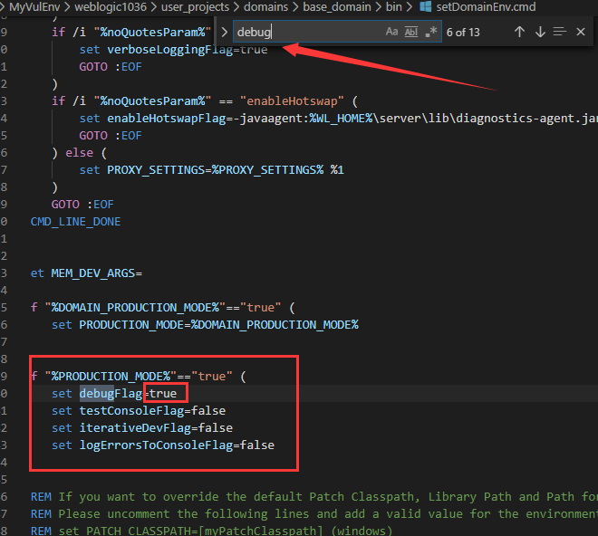
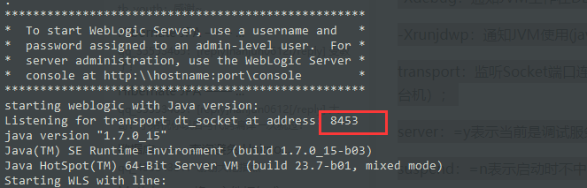
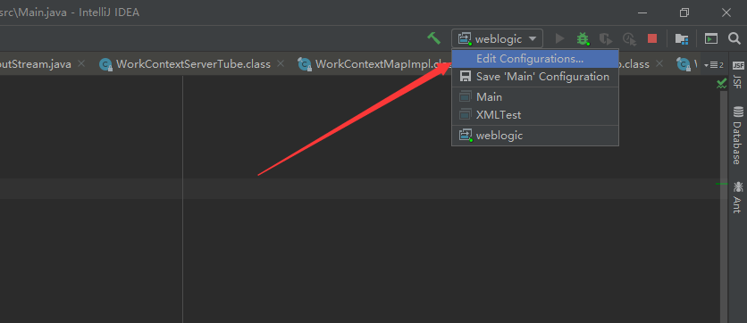
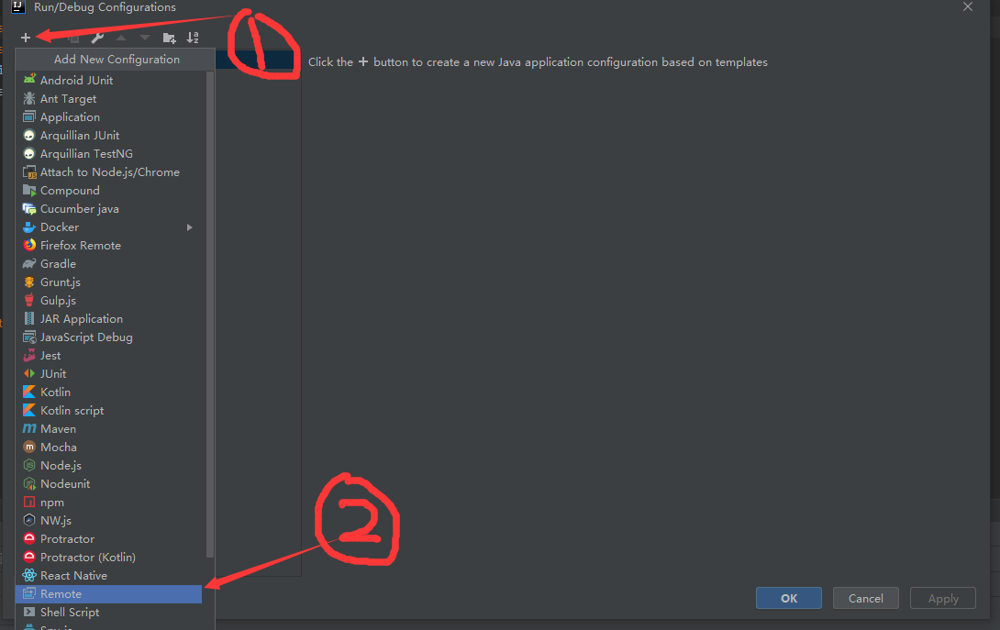
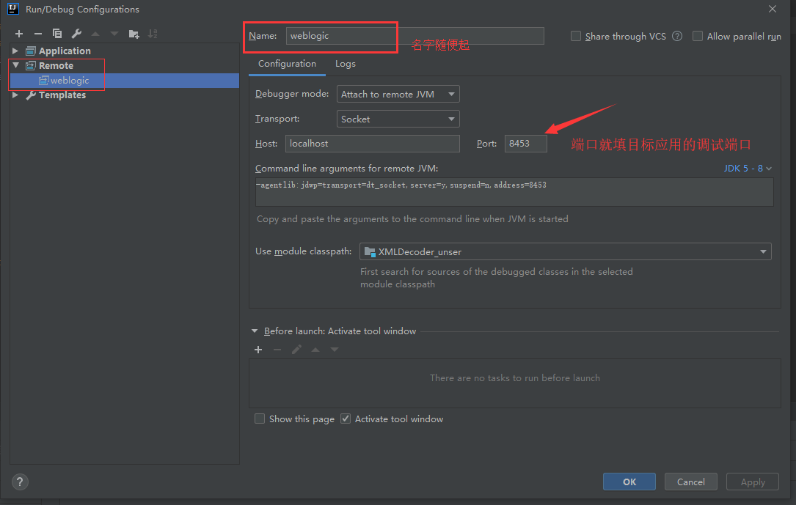
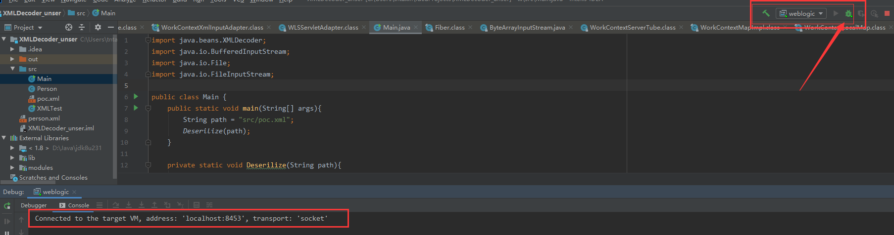
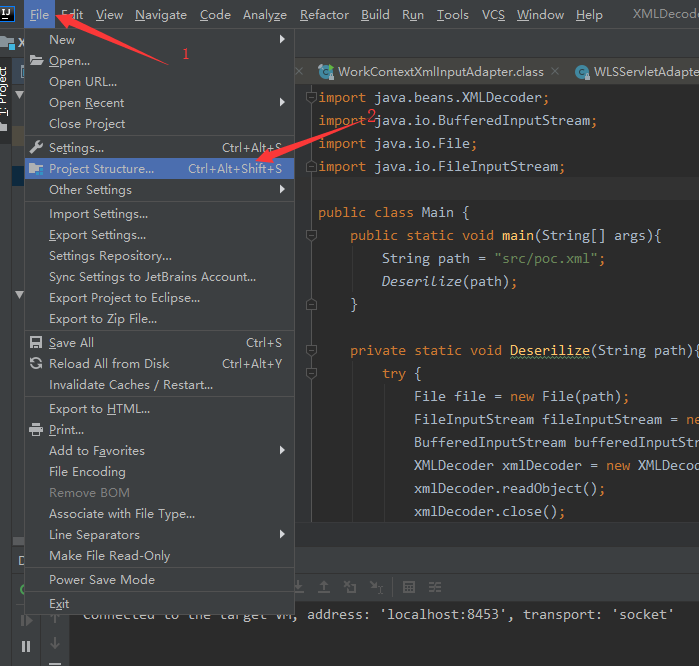
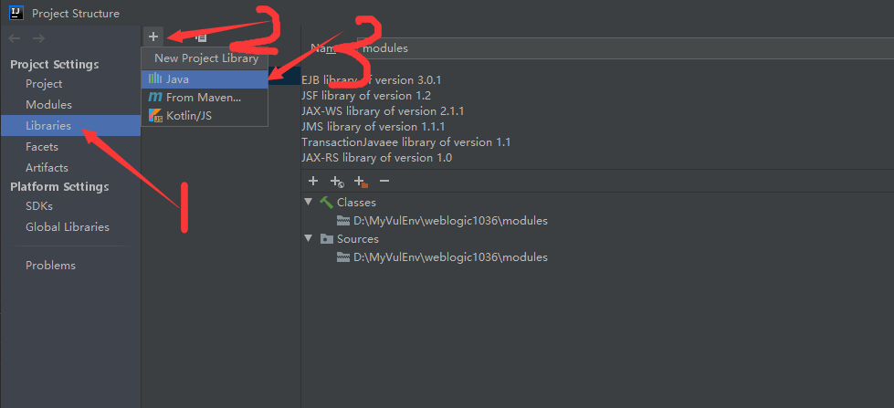
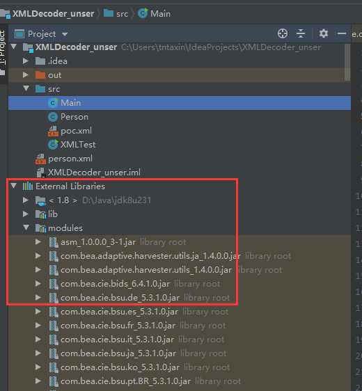

### 0x01 前言

本文将结合着远程调试weblogic来讲解如何使用IDEA调试远程应用，大家只要掌握核心科技就行

### 0x02 开启JAVA应用的调试模式

一个应用想要被远程调试，必须以调试模式运行，对于jar包，开启调试模式也很简单

`java -Xdebug -Xrunjdwp:transport=dt_socket,server=y,suspend=n,address=8000 -jar test.jar `

参数说明：

-Xdebug：通知JVM工作在DEBUG模式下；

-Xrunjdwp：通知JVM使用(java debug wire protocol)来运行调试环境；

transport：监听Socket端口连接方式（也可以dt_shmem共享内存方式，但限于windows机器，并且服务提供端和调试端只能位于同一台机）；

server：=y表示当前是调试服务端，=n表示当前是调试客户端；

suspend：=n表示启动时不中断（如果启动时中断，一般用于调试启动不了的问题）；

address：=8000表示本地监听8000端口。

当然，对于Weblogic这种别人写的大型应用，启动是很复杂的，一般都会有一个启动脚本或者环境配置脚本什么的，要想使这些应用运行在debug模式下，一般都是需要修改对应脚本的，至于到底是修改哪个脚本，我们可以Google一下，当然，如果搜索的结果不靠谱，也是可以自己摸索的，主要就是通过粗略阅读启动脚本，搜索脚本中的debug、port等关键字，然后修改对应的值（只是这么一个思路，具体情况具体分析）

weblogic就是一个通过脚本启动的应用，且它有一个专门的环境配置脚本，要想让Weblogic运行在debug模式下，就要修改这个脚本

如上图所示，由于我Weblogic是以产品模式安装的，所以我把setDomainEnv.cmd对应位置的debugFlag改为了true,然后运行启动脚本，Weblogic就会以调式模式运行。在同文件中还可以找到应用是调试端口是哪一个,当然，weblogic运行时，在控制台也打印出来了，如果你不清楚某个引用的默认调试端口，你甚至可以百度一下~

### 0x03 IDEA配置远程调试

现在目标应用已经运行在调试模式，且我们也知道其监听的端口了，现在就是需要在IDEA上进行配置了。同样以Weblogic为例

1. **用IDEA随便新建一个工程**
2. **然后IDEA的右上角，配置一下**

3. **创建一个remote server**

4. **配置remote server**

5. **最后选择在右上角我们刚刚创建的remote server,然后点击这个小虫子**

可以从控制台看到，我们的idea已经成功连接到远端的应用

你以为这就结束了吗？并没有,因为要调试的是远程的应用，我们本地原本是没有远程应用的代码的，所以，即使是调试远程的应用，我们本地也要有一份远程应用的代码，没想到吧，死靓仔~

我们下载好了远程应用的代码，然后需要把我们要调试的jar包啥的放到对应项目的lib下。具体操作如下，以weblogic为例，我要把weblogic中的一些关键jar包加到lib中：

然后选择对应的目录就行了，一般就是把包含jar包的目录加进来,添加完过后就可以在IDEA中访问到很多jar包了，并且IDEA会自动反编译这些jar包中的class文件，我们还可以在对应的文件处下断点，然后就可以开始愉快的调试了~

### 其他

一直在纠结有没有必要写这一章的内容，毕竟网上有挺多现成的，而且写好了，我不知道把本章内容放在哪个位置才合适，放在系统文章的开头，可能大家一时半会用不到，放在系列文章的中间，我又怕大家在看到这篇文章前就已经自己摸索出了怎么远程调试，那么我的这篇文章不就没用了吗~

算了，为了系列文章的对新手友好，我还是稍微写一下吧

