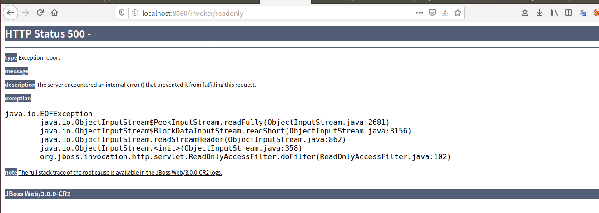
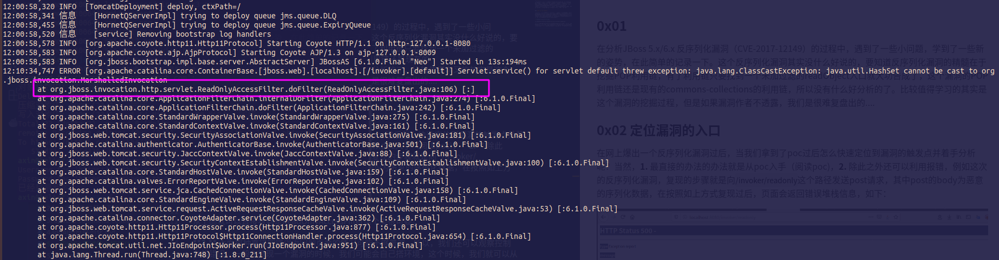
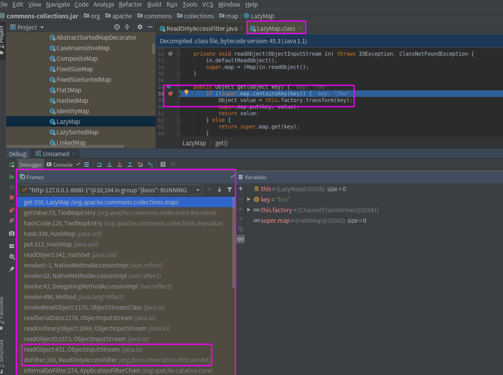
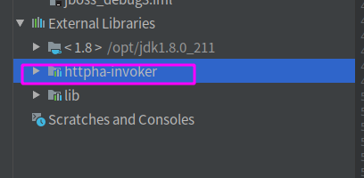
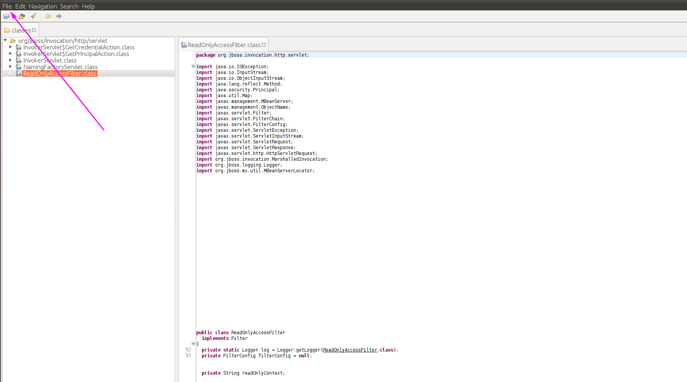
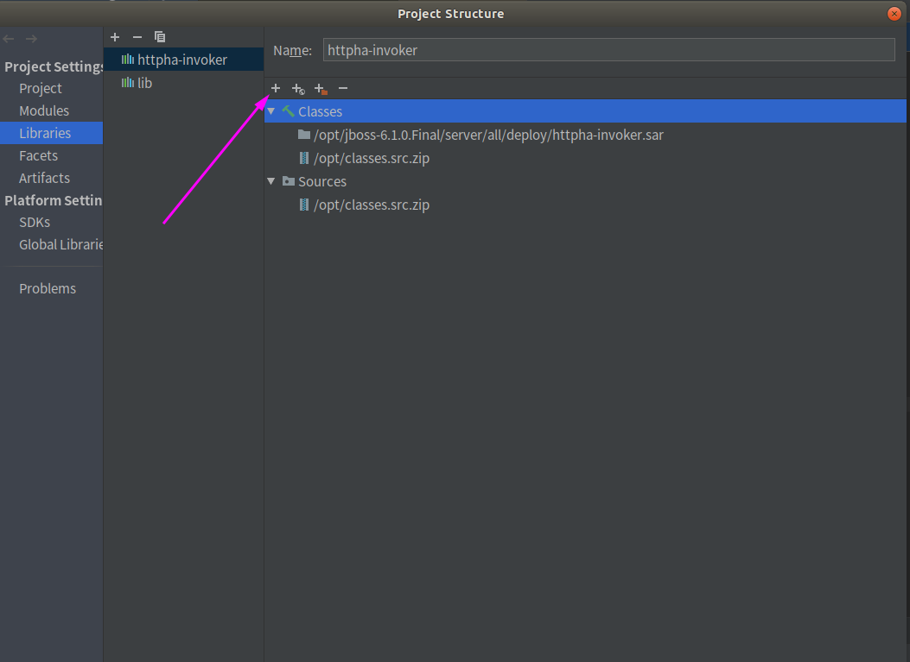
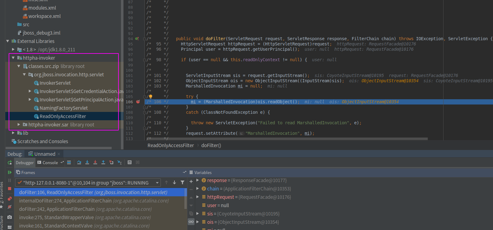

### 0x01

在分析JBoss 5.x/6.x 反序列化漏洞（CVE-2017-12149）的过程中，遇到了一些小问题，学到了一些新的姿势，在此简单的记录一下。这个反序列化漏洞其实没什么好说的，要知道反序列化漏洞的精髓在于挖掘POP利用链，有了利用链只要找到一个未加过滤的readObject入口就大功告成了，这个漏洞的POP利用链还是现有的commons-collections的利用链，所以没有什么好分析的了。比较值得学习的其实是这个漏洞的挖掘过程，但是如果漏洞作者不透露，我们是很难复盘出的....

### 0x02 定位漏洞的入口

在网上爆出一个反序列化漏洞过后，当我们拿到了poc过后怎么快速定位到漏洞的触发点并着手分析呢？当然，**1.** 最直接的办法的办法就是从poc入手（阅读poc)，**2.** 除此之外还可以利用报错，例如这次的反序列化漏洞，复现的步骤就是向`/invoker/readonly`这个路径发送post请求，其中post的body为恶意的序列化数据，在按照如上方式复现过后，页面会返回错误堆栈信息，如下：

从上面就可以直接看到是ReadOnlyAccessFilter这个类很可疑。

**3.** 上面那种直接把错误返回到页面的情况可能不够普遍，所以，我们还可以观察控制台的错误，一般在复现一个漏洞的时候，我们可能会自己搭环境，这个时候，我们就可以从自己搭建的漏洞环境中的报错信息得到更多的线索，更加详细的错误堆栈情况：

**4.** 还有一种方式，就是利用idea调试，还是以jboss这次的漏洞为例，前面不是提到了这里利用的POP链是我们已知的吗，那么我们可以在IDEA调试的时候在我们知道熟知的地方（就是该漏洞一定会触发的代码处）下断点，然后发送poc,就会触发我们的断点，在IDEA的这个位置就可以看到堆栈调用情况：

可见，我们上面的断点是打在了LazyMap的get方法处，LazyMap的利用链我们在之前也已经分析过了，如果存在漏洞，反序列化的时候一定会执行到这里的，所以一定会触发到此处断点，然后就可以在左下角看到在触发get方法前的整个堆栈调用情况，我们也就可以在这里寻找可以的类以及以及函数。

ps:  如果你不清楚那个jar包有问题，在调试的时候就把所有的jar包都加入到lib中，这样方便看到源码。

有时候，当你已经七八分确定就是某个类有问题的时候，你就可以在idea中全局搜索这个类了然后看类的具体实现，以便进一步确认，如果搜不到，说明你还没有把所有的jar包加入到lib下～别忘了，war包里也是有类的~~有些war包里也是有jar包的~~，我这次调试jboss就是被这个给坑了一把，找了半天的类，愣是找不到，最后发现在war包里，所以，把war包也给加到lib下。

### 0x03 解决断点触发不了的问题

有时候，你明明感觉问题就是出在这个类，而且你觉得漏洞触发后一定会执行到你的断点处，但是在你用idea调试的时候，偏偏就没触发你的断点...这时候你可能会有点怀疑人生，没事，我也会，我在调试jboss的时候也就遇到了这个问题，这次的漏洞点在一个war包中，但是这个war包中的断点愣是不触发。其实只要给class文件配置sources就可以解决这个问题，配置了sources文件过后，把断点打在对应的sources文件处，就可以正确地触发断点了。

一些不开源的应用我们可以通过反编译的方式拿到源码，例如下面的httpha-invoker:

这其实就是一个war包，里面只有经过编译的class文件，没有java源文件，我们首先通过jd-gui反编译这个war包中的所有class,然后点击左上角的file,在下拉菜单中选择save all sources,就可以把所有反编译的java文件保存到一个压缩包中。

然后我们回到idea中，把这个压缩包配置为httpha-invoker这个war包的源码文件就行。

直接点击上图箭头指向的那个+号，然后选择刚刚保存的压缩包，添加进来就行。

然后就可以直接到压缩包中的源码里下断点，运行poc的时候，就能够成功触发断点了～这样就确认这里确实是漏洞触发点，并且可以进一步往下分析了。

### 0x04 其他

在使用idea过程中还因为不了解idea的一些特性而浪费了很多时间，所以，这里贴一份idea的帮助手册：

https://www.jetbrains.com/help/idea/2019.1/creating-and-registering-file-types.html?utm_campaign=IU&utm_medium=link&utm_source=product&utm_content=2019.1#create-new-file-type

关于本漏洞的复现参考：

https://github.com/vulhub/vulhub/tree/master/jboss/CVE-2017-12149