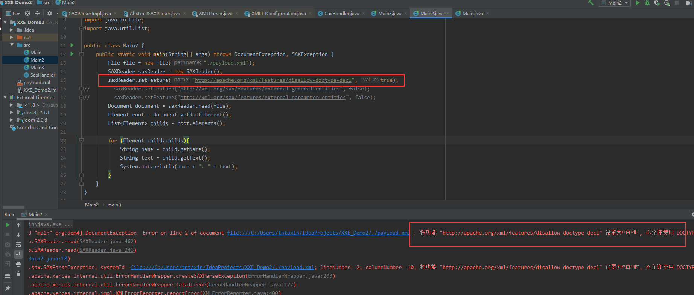
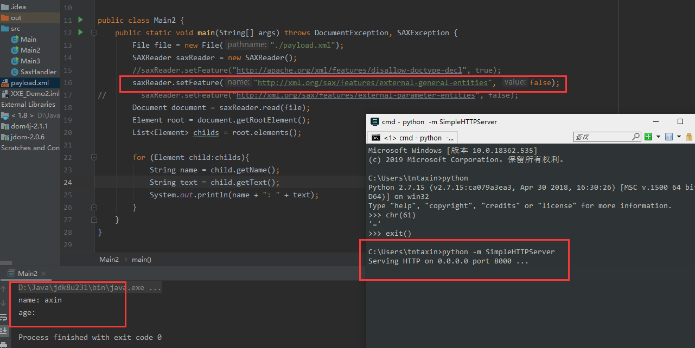
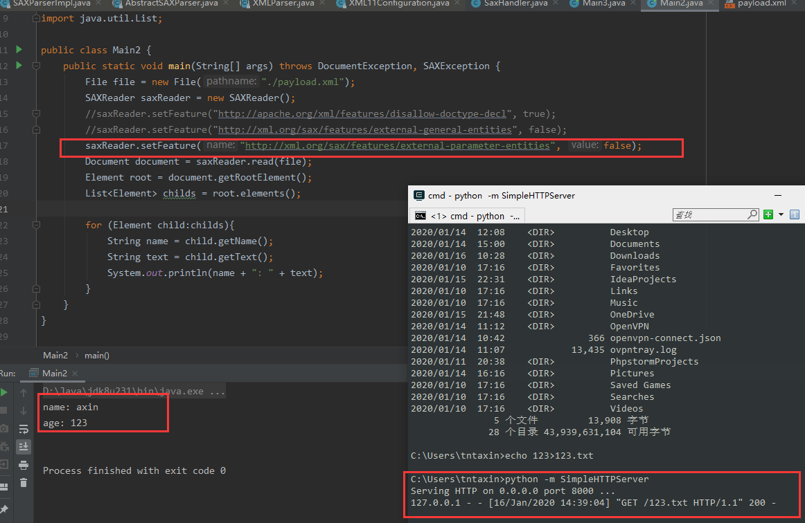
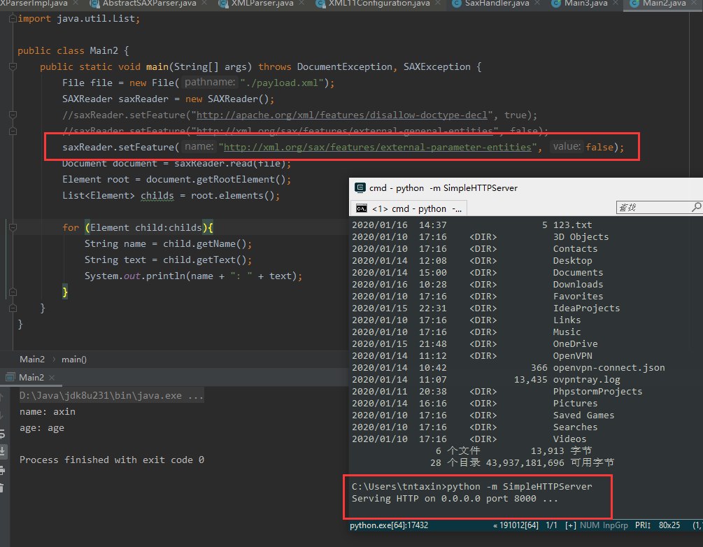

### 0x01 前言

这一章只谈JAVA中XXE的防御方法，文章不长，只说重点

### 0x02 防御手法

我在《XXE之DocumentBuilder》文末蜻蜓点水般提到了XXE的防御方法，这一章，我们详细来说说，由于java中各个xml解析类防御xxe的方法都大同小异，我就那SAXReader来演示吧

要想完全防御住xxe攻击，需要设置以下三个属性，如果遗漏了其中一个，应用都是有可能受到XXE攻击的，只是说危害程度不同

```java
saxReader.setFeature("http://apache.org/xml/features/disallow-doctype-decl", true);
saxReader.setFeature("http://xml.org/sax/features/external-general-entities", false);
saxReader.setFeature("http://xml.org/sax/features/external-parameter-entities", false);
```

那么每个特性都是啥意思呢，又有啥用呢，大家可以仔细阅读一下每个特性的名字，可以猜到个大概。

##### disallow-doctype-decl

看名字，就是不允许文档类型声明（不允许定义Doctype)，将这个特性设置为true后，基本可以防御大部分xxe攻击,我们看设置过后的效果



直接报错，从报错中可以看到设置了该属性后就不能在xml文件中声明Doctype了，xml文件还是《XXE之DocumentBuilder》中的哪个payload.xml,这里就不列出来了


##### external-general-entities

这个特性看名字就是与外部普通实体挂钩的啦。当把这个特性设置为false,xml出现外部普通实体就是不会解析的，为了更好的观察，我们改一下xml文件，改成这样：

```xml
<?xml version="1.0" encoding="utf-8" ?>
<!DOCTYPE root [
        <!ENTITY test SYSTEM "http://localhost:8000/123.txt">
        ]>
<person>
    <name>axin</name>
    <age>&test;</age>
</person>
```

然后用python快速搭建一个http server:

`python -m SimpleHTTPServer`

我们看一下当我们把特性external-general-entities设置为false时会是怎样的结果：



可见，果然没有解析外部实体，http server都没有收到任何请求，但是在这种情况下，还是可以使用外部参数实体的

##### external-parameter-entities

当这个特性设置为false, 将会禁用外部**参数**实体, 而不会禁止普通实体，关于XXE漏洞以及XML文件的基础知识我这里暂且不谈，欲进一步了解移步： https://thief.one/2017/06/20/1/

我们先用普通的外部实体测试一下，可见能够正常解析，如下：




然后，修改一下xml文件，改用参数实体：

```java
<?xml version="1.0" encoding="utf-8" ?>
<!DOCTYPE root [
        <!ENTITY % test SYSTEM "http://localhost:8000/123.txt">
        %test;
        ]>
<person>
    <name>axin</name>
    <age>age</age>
</person>
```

如果正常解析的话，http server是应该能够收到请求的，但是结果如下：



可见确实解析不了外部参数实体了...

### 其他

更详细的防御手册：https://github.com/OWASP/CheatSheetSeries/blob/master/cheatsheets/XML_External_Entity_Prevention_Cheat_Sheet.md

虽然，针对不同类的防御方法有些许出入，但是核心不变，所以，你今天掌握了核心科技了吗~