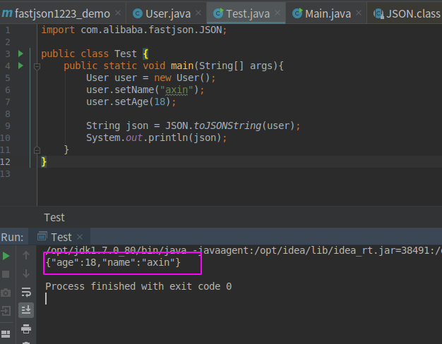
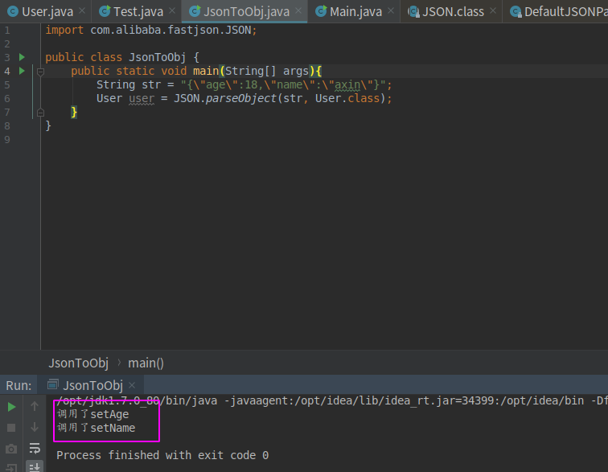
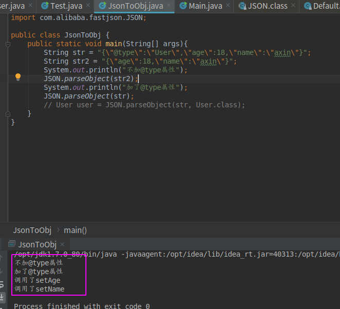

### 0x01 前言

前一章简单介绍了jndi注入的知识，这一章主要是分析一下fastjson 1.2.24版本的反序列化漏洞，这个漏洞比较普遍的利用手法就是通过jndi注入的方式实现RCE，所以我觉得是一个挺好的JNDI注入实践案例。


#### 0x02 fastjson反序列化特点

不同于我们之前提到的java反序列化，fastjson的序列化有其自身特点，我们通过一些小demo来展示如何使用fastjson。我们常说的fastjson的序列化就是将java对象转化为json字符串，而反序列化就是将json字符串转化为java对象。

- fastjson 序列化demo:

```java
import com.alibaba.fastjson.JSON;

public class Test {
    public static void main(String[] args){
        User user = new User();
        user.setName("axin");
        user.setAge(18);

        String json = JSON.toJSONString(user);
        System.out.println(json);
    }
}
```

其中User类如下：

```java
public class User {
    private int age;
    public String name;
    public void sayHello(){
        System.out.println("Hello, I am "+name);
    }
    public void getName(){
        System.out.println(name);
    }

    public int getAge() {
        return age;
    }

    public void setAge(int age) {
        this.age = age;
    }

    public void setName(String name) {
        this.name = name;
    }
}
```

运行Test类，就会得到如下json字符串：




- fastjson 反序列化demo


fastjson反序列化有个特点，就是会自动调用目标对象的setXXX方法，例如{"name","axin", "age": 18}被反序列化时会自动调用对应对象的setName以及setAge方法，我们用代码实践一下，看看是否的确如此

修改一下User类：

```java
public class User {
    private int age;
    public String name;
    public void sayHello(){
        System.out.println("Hello, I am "+name);
    }
    public void getName(){
        System.out.println(name);
    }

    public int getAge() {
        return age;
    }

    public void setAge(int age) {
        this.age = age;
        System.out.println("调用了setAge");
    }

    public void setName(String name) {
        this.name = name;
        System.out.println("调用了setName");
    }
}
```

然后新建一个反序列化的类：

```java
import com.alibaba.fastjson.JSON;

public class JsonToObj {
    public static void main(String[] args){
        String str = "{\"age\":18,\"name\":\"axin\"}";
        User user = JSON.parseObject(str, User.class);
    }
}
```

运行该类，得到如下结果，说明反序列化的过程中确实调用了setXXX方法：



其实fastjson反序列化是有两个api的，一个是上面demo中用到的parseObject()还有一个是parse()方法，他们的最主要的区别就是前者返回的是JSONObject而后者返回的是实际类型的对象，当在没有对应类的定义的情况下，通常情况下都会使用JSON.parseObject来获取数据。

而且在直接使用JSON.parseObject()方法反序列化json字符串的时候是不会调用对应对象的setXXX方法的，那么怎么才能让直接使用JSON.parseObject()反序列化的对象也调用setXXX方法呢，答案是利用@type属性，来看下对比：



可见加了@type属性就能调用对应对象的setXXX方法，那这个@type属性具体是干嘛的呢?其实从上面的demo应该也能得知一二了，就是指定该json字符串要反序列化到哪个类。这个属性让我们的漏洞利用如鱼得水～

> ps: fastjson反序列化默认只能反序列化共有属性，如果想要对应的私有属性也被反序列话，则需要下面这样添加一个Feature.SupportNonPublicField参数：
> `JSON.parseObject(myJSON, User.class, Feature.SupportNonPublicField);`


