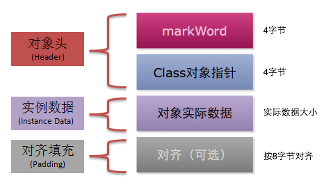
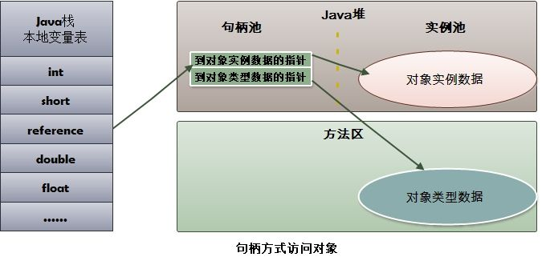
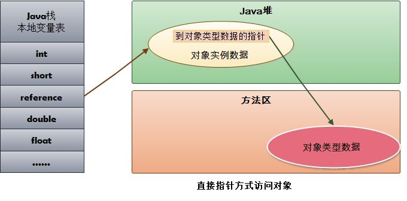

### hotspot虚拟机内存实现

#### 对象的创建（对象的内存分配方式）

当Java虚拟机遇到一条字节码new指令时，首先将去检查这个指令的参数是否能在常量池中定位到 一个类的符号引用，并且检查这个符号引用代表的类是否已被加载、解析和初始化过。如果没有，那 必须先执行相应的类加载过程

分配内存的方式：指针碰撞、空闲列表

##### 指针碰撞

假设java堆中的内存绝对规整，分配的内存放在一边，未分配的放在另一边，那么便可以用一个指针来区分开两块内存区域

每次新建对象分配内存时，只需要将指针移动对象大小相等的距离

##### 空闲列表

如果java堆中的内存不规整，也就是分配的内存和未分配的内存相互交错，那么久不能简单用一个指针来区分它们了，这时候就需要用一张表来记录哪些内存已经使用，哪些未被使用

当新建对象时需要到这个表里去寻找一块足够大的内存进行分配，并更新列表

而堆中内存师傅规整取决于jvm所采用的的垃圾收集器是否带有空间压缩整理（Compact）的能力决定，带压缩功能的垃圾收集器进行垃圾收集后，会将堆中空间进行规整，所以这时候就可以采用指针碰撞的方式来分配内存

上面介绍了两种基本的对象内存分配方式，但是对象的创建不仅仅是简单的分配内存，还有一些后续工作以及注意事项

注意事项：对于一个多线程的环境，可能会有多个对象同时创建，虽然之前说了给对象分配内存只需要简单的移动一下指针，但是在并发情况下，两个对象可能会去抢一块内存空间，分配内存时必须保证操作的原子性，hotspot采用了用CAS配上失败 重试的方式保证更新操作的原子性（cas其实是一种乐观锁），另外一种是把内存分配的动作按照线程划分在不同的空间之中进 行，即每个线程在Java堆中预先分配一小块内存，称为本地线程分配缓冲（Thread Local Allocation Buffer，TLAB），哪个线程要分配内存，就在哪个线程的本地缓冲区中分配，只有本地缓冲区用完 了，分配新的缓存区时才需要同步锁定

内存分配完过后，还需要对分配到的内存空间初始化为0值（不包括对象头部分），初始化为0是为了保证java对象中的字段在不赋初始值的情况下也可以使用

除了对象的数据部分初始化为0之外，还需要对对象本身进行一些数据设置，比如说这个对象属于哪个类，对象的哈希码，对象的GC分代年龄等信息，这些信息都存放在**对象头**中。根据虚拟 机当前运行状态的不同，如是否启用偏向锁等，对象头会有不同的设置方式

上面的操作执行完，对于我们程序员来说，这个对象还没真正的初始化，因为我们的构造函数还没有执行，各个字段的值还不是我们想要的样子，所以，接下来虚拟机会执行对象的`<init>()`，对对象的各个字段按照程序员的意图进行初始值设置，这一步完成之后，一个对象就真正的创建出来了

#### 对象的内存布局

- 对象头
- 对象实例数据
- 填充

##### 对象头

存储着这个对象的元信息，如：hash码、gc分代年龄、锁状态标志、线程持有的锁、偏向线程ID、偏向时间戳、以及类型指针（指向该对象对应的类）

##### 对象实例数据

对象中的字段的值等等

##### 对齐填充

hotspot虚拟器要求对象起始地址必须是8字节的整数倍，如果实例数据部分没有对齐，就需要填充以对齐

#### 对象的访问方式

##### 句柄访问方式

当一个引用引用了某个对象时，这个引用指向了一张表中的某个地址，然后通过这种表找到对象的真实地址以及对象类型地址

- 查找对象较慢
- 但垃圾收集后，只需要简单修改表中的对象地址

##### 直接指针访问方式

这次没有中间那张表作路由，引用直接通过指针指向对象真实地址

- 查找对象快
- 但在有垃圾收集时，需要更改所有引用处指针指向的地址
- 且需要额外的空间存储对象类型地址

### 参考

https://github.com/pengMaster/BestNote/blob/master/docs/java/%E5%8F%AF%E8%83%BD%E6%98%AF%E6%8A%8AJava%E5%86%85%E5%AD%98%E5%8C%BA%E5%9F%9F%E8%AE%B2%E7%9A%84%E6%9C%80%E6%B8%85%E6%A5%9A%E7%9A%84%E4%B8%80%E7%AF%87%E6%96%87%E7%AB%A0.md