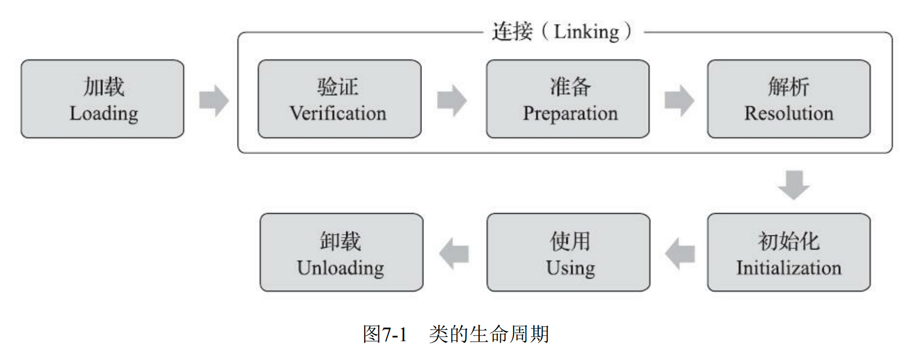
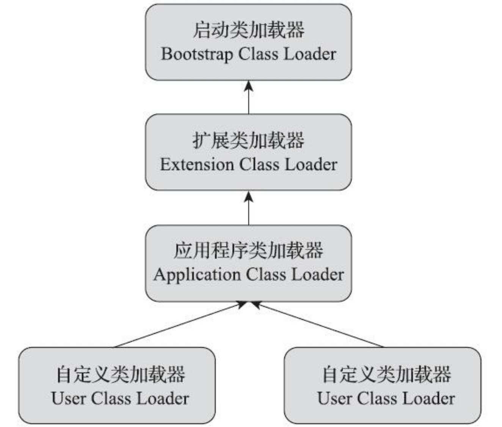

上一章，我们一起认识了class文件的结构，而一个class文件想要执行，还得要加载到jvm中才行


所以，今天我们就一起来学习一下JVM的类加载机制，看看一个class文件是如何闪转腾挪变为我们常说的一个java类的

先来看一下整个类加载的生命周期



### 类加载的时机


加载、验证、准备、初始化和卸载这五个阶段的顺序是确定的，类型的加载过程必须按 照这种顺序按部就班地开始，而解析阶段则不一定：它在某些情况下可以在初始化阶段之后再开始， 这是为了支持Java语言的运行时绑定特性（也称为动态绑定或晚期绑定）。

在六种情况下，类必须进行初始化（自然，在初始化之前，加载、验证、准备阶段也都会执行）：

- 遇到new、getstatic、putstatic或invokestatic这四条字节码指令时，如果类型没有进行过初始 化，则需要先触发其初始化阶段
- 使用java.lang.reflect包的方法对类型进行反射调用的时候，如果类型没有进行过初始化，则需 要先触发其初始化。
- 当初始化类的时候，如果发现其父类还没有进行过初始化，则需要先触发其父类的初始化
- 当虚拟机启动时，用户需要指定一个要执行的主类（包含main()方法的那个类），虚拟机会先 初始化这个主类。
- 当使用JDK 7新加入的动态语言支持时，如果一个java.lang.invoke.MethodHandle实例最后的解 析结果为REF_getStatic、REF_putStatic、REF_invokeStatic、REF_newInvokeSpecial四种类型的方法句 柄，并且这个方法句柄对应的类没有进行过初始化，则需要先触发其初始化。
- 当一个接口中定义了JDK 8新加入的默认方法（被default关键字修饰的接口方法）时，如果有 这个接口的实现类发生了初始化，那该接口要在其之前被初始化


可以看到，上面六种情况都是因为要使用到具体的类，使用之前肯定得先有这个类对吧，所以必须得先执行类的初始化

### 类加载的过程

#### 加载

类加载的第一个过程是加载，加载过程jvm做了三件事：

- 通过一个类的全限定名来获取定义此类的二进制字节流。
- 将这个字节流所代表的静态存储结构转化为方法区的运行时数据结构。
- 在内存中生成一个代表这个类的java.lang.Class对象，作为方法区这个类的各种数据的访问入 口。

由于《Java虚拟机规范》对着三者的要求并不具体，没有规定，二进制字节流必须从某个Class文件加载，确切地说是根本没有指明要从哪里获取、如何获取，所以给开发者们留下了很大的开发空间，class文件可以从：

- 从ZIP压缩包中读取，这很常见，最终成为日后JAR、EAR、WAR格式的基础。 
- 从网络中获取，这种场景最典型的应用就是Web Applet，java开发者所熟知的URLClassloader就可以加载远程的class文件
- 运行时计算生成，这种场景使用得最多的就是动态代理技术，在java.lang.reflect.Proxy中，就是用 了ProxyGenerator.generateProxyClass()来为特定接口生成形式为“*$Proxy”的代理类的二进制字节流。 
- 由其他文件生成，典型场景是JSP应用，由JSP文件生成对应的Class文件。 
- 从数据库中读取，这种场景相对少见些，例如有些中间件服务器（如SAP Netweaver）可以选择 把程序安装到数据库中来完成程序代码在集群间的分发。 
- 可以从加密文件中获取，这是典型的防Class文件被反编译的保护措施，通过加载时解密Class文 件来保障程序运行逻辑不被窥探。

**注：** 连接阶段的部分行为会与加载阶段交叉进行，例如：在加载尚未结束时，就可以对加载成功的部分二进制流进行文件格式验证

#### 验证

验证阶段是为了验证class的字节流中的数据是否符合《Java虚拟机规范》的要求，虽然java通过javac编译过后的class文件可以确保是符合规范的，但是class文件毕竟是一个普通文件，是可以被修改的，验证阶段就是为了避免不规范的class被jvm使用，从而危害jvm安全

**下面的为扩展内容，可以选择性阅读**


验证阶段做的事情很多，简单介绍几个：

##### 文件格式验证

- 是否以魔数0xCAFEBABE开头。 
- 主、次版本号是否在当前Java虚拟机接受范围之内。
...

文件格式验证只需要对二进制流进行操作就行，文件格式验证通过后，二进制流就按照特定的格式被存储在jvm的内存中了

**下面提到的一些验证也就不再依赖二进制流，而是依赖于class文件在方法区中的存储结构进行的**


##### 元数据验证

对字节码进行简单的语义分析，例如：

- 这个类是否有父类（除了java.lang.Object之外，所有的类都应当有父类）。 
- 这个类的父类是否继承了不允许被继承的类（被final修饰的类）。

...

##### 字节码验证

在第二阶段对元数据信息中的数据类型校验完毕以后，这阶段就要 对类的方法体（Class文件中的Code属性）进行校验分析，保证被校验类的方法在运行时不会做出危害 虚拟机安全的行为

- 保证任意时刻操作数栈的数据类型与指令代码序列都能配合工作，例如不会出现类似于“在操作 栈放置了一个int类型的数据，使用时却按long类型来加载入本地变量表中”这样的情况。 
- 保证任何跳转指令都不会跳转到方法体以外的字节码指令上
...

##### 符号引用验证

符号引用验证其实和解析阶段结合的比较紧密，解析阶段做的事情就是把符号引用转换为直接引用，而符号引用验证做的事情其实就是看在这个转换过程中，是否会出现差错，例如：该类是否缺少或者被禁止访问它依赖的某些外部 类、方法、字段等资源

在上一章《Class文件结构》中，我们有个类`Axin`：

```java
package org.example;  
  
public class Axin {  
    private int age;  
  
    public Axin() {  
    }  
  
    public void sayHello() {  
        System.out.println("hello");  
    }  
}
```

这里面用到了`System.out.println`方法，`System.out.println`其实就是一个符号引用，它的直接引用是一个地址或者是指向该方法地址的指针，而符号引用验证就是验证`Axin`类是不是可以访问`System.out`等等...

- 符号引用中通过字符串描述的全限定名是否能找到对应的类。 
- 在指定类中是否存在符合方法的字段描述符及简单名称所描述的方法和字段。 
- 符号引用中的类、字段、方法的可访问性（private、protected、public、）是否可被当 前类访问。


#### 准备

准备阶段是正式为类变量（静态变量）分配内存（方法区分配）并赋初始值的阶段，但是这里的初始值是0而不是代码中所赋的值

例如如下代码：

```
public static int value = 123;
```

在准备阶段后，类变量value的值是0而不是123，因为在准备阶段还没有任何java方法被执行，而给类变量赋值的操作是需要调用类构造器`<clinit>()`方法中的putstatic指令的

#### 解析

**问：为啥要将符号引用转化为直接引用**
**答：因为符号引用就只是一个字面量，与内存结构无关，仅仅通过字面量无法确认该引用在jvm内存中的地址，也就无法使用它，所以必须要将符号引用转换为能够定位到内存地址的直接引用，比如我们要调用System.out.println方法，我们必须要找到println方法在内存中的起始地址，这样才能执行里面的字节码**

将符号引用转化为直接引用

1.  符号引用：字符串，能根据这个字符串定位到指定的数据，比如java/lang/StringBuilder
2.  直接引用：内存地址或指向对应内存地址的指针、句柄

**下面为扩展内容**

《Java虚拟机规范》之中并未规定解析阶段发生的具体时间，只要求了在执行ane-warray、 checkcast、getfield、getstatic、instanceof、invokedynamic、invokeinterface、invoke-special、 invokestatic、invokevirtual、ldc、ldc_w、ldc2_w、multianewarray、new、putfield和putstatic这17个用于 操作符号引用的字节码指令之前，先对它们所使用的符号引用进行解析。

##### 类或接口解析

假设当前代码所处的类为D，如果要把一个从未解析过的符号引用N解析为一个类或接口C的直接 引用

1）如果C不是一个数组类型，那虚拟机将会把代表N的全限定名传递给D的类加载器去加载这个 类C。在加载过程中，由于元数据验证、字节码验证的需要，又可能触发其他相关类的加载动作，例 如加载这个类的父类或实现的接口。一旦这个加载过程出现了任何异常，解析过程就将宣告失败。

(数组类型的解析过程忽略...)

如果上面没有出现任何异常，那么C在虚拟机中实际上已经成为一个有效的类或接口了， 但在解析完成前还要进行符号引用验证，确认D是否具备对C的访问权限。如果发现不具备访问权限， 将抛出java.lang.IllegalAccessError异常。

##### 字段解析

字段解析先要解析该字段所对应的类的直接引用，然后在该类中查找是否拥有对应的字段，如果没找到回去找该类所实现的接口以及父类（如果有的话），找到了就返回该字段的直接引用

##### 方法解析

大体过程类似字段解析


#### 初始化

执行类构造器方法`<clinit>()`对类变量以及类中各种静态代码块中的变量进行赋值操作

**注：这里是类变量初始化，而不是实例初始化**


### 类加载器

加载过程是通过类加载器实现的

- 对于 任意一个类，都必须由加载它的类加载器和这个类本身一起共同确立其在Java虚拟机中的唯一性，每 一个类加载器，都拥有一个独立的类名称空间

站在java虚拟机的角度来看，只存在两种类加载器：一种是启动类加载器（Bootstrap ClassLoader)，它采用c++实现，是虚拟机的一部分，还有一种就是其他所有的类加载器，采用java语言实现，独立于虚拟机外部，并且全都继承自`java.lang.ClassLoader`

而站在程序员的角度，类加载器应该更细化一点，java一直保持着三层类加载器、双亲委派的类加载架构

- 启动类加载器，负责加载`<JAVA_HOME>\lib`目录下的或者被-Xbootclasspath参数所指定的路径中存放的类库到虚拟机内存中
- 扩展类加载器（Extension Class Loader），它负责加载\lib\ext目录中，或者被java.ext.dirs系统变量所 指定的路径中所有的类库
- 应用程序类加载器（Application Class Loader），它负责加载用户类路径 （ClassPath）上所有的类库


前面也提到了，两个类是否相等是由加载这个类的类加载器和它本身确定的，为了确保一些java基础类在java内存中的唯一性，jvm的类加载器采用了双亲委派的架构

双亲委派架构：



简单一句话解释这个架构就是：如果一个类加载器收到了类加载的请求，他不会第一时间自己去加载这个类，而是把这个加载委派给自己的父类加载器去完成，每一层都是如此，所以，其实所有的类加载请求最终都会传送到最顶层的类加载器，只有当最顶层的反馈无法加载时，才会用下一级的类加载器加载


### 参考地址

《深入理解Java虚拟机：JVM高级特性与最佳实践（第3版）周志明.pdf》


https://github.com/doocs/jvm


http://wenku.uml.com.cn/document/java/JVM%E8%AF%A6%E8%A7%A3.pdf