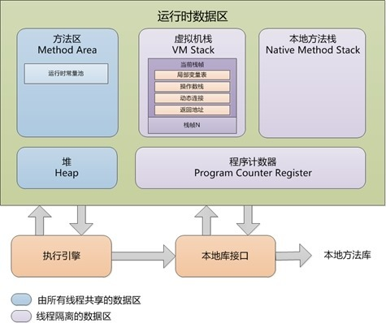
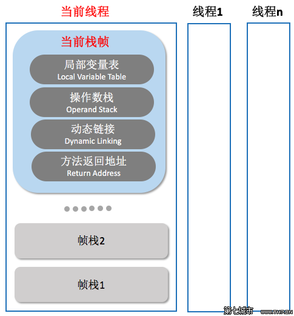

在这之前，我们已经学习了class文件的结构以及class是怎样被加载的，那一个class文件加载到内存中后，它是以怎样的方式存储、存储在哪里的呢？

下面让我们一起来看看jvm的内存结构吧，本章仅简单地介绍每个区域的作用

### 堆

- 线程共享
- 存放所有对象实例
- jvm垃圾收集的主要场所

### 方法区

- 线程共享
- 存储已被虚拟机加载的类型信息、常量、静态变量等（class文件中的常量池部分）
- 运行时常量池是方法区的一部分，**class文件中的常量池中的常量在被加载到jvm中时就会放在这里**

### 虚拟机栈

- 线程私有

每个方法执行的时候都会创建一个栈帧，这个栈帧中存放着：

局部变量表、操作数栈、动态链接、方法出口

局部变量表（Local Variables Table）是一组变量值的存储空间，用于**存放方法参数和方法内部定义 的局部变量**。局部变量表占用的变量槽数量在编译时就确定了（这个可以从class文件结构窥见），在生成class文件时，每个方法表中都有一个max_locals变量。对于实例方法（非static修饰的方法），局部变量表中的第0个变量是代表该实例对象的引用

操作数栈又是一个栈，这个栈是提供给各种字节码命令用的，比如在执行`iadd`命令对两个数进行求和操作前就需要先将iadd的两个操作数压如操作数栈，执行iadd命令时，这两个操作数会自动被弹出栈，iadd执行结束后，会将求和结果压入栈供后续命令使用..

每个栈帧都包含一个指向运行时常量池中该栈帧所属方法的引用，持有这个引用是为了支持方 法调用过程中的动态连接（Dynamic Linking）.我们知道Class文件的常量池中存 有大量的符号引用，字节码中的方法调用指令就以常量池里指向方法的符号引用作为参数。这些符号 引用一部分会在类加载阶段或者第一次使用的时候就被转化为直接引用，这种转化被称为静态解析。 另外一部分将在每一次运行期间都转化为直接引用，这部分就称为动态连接

**问：这里的动态连接，存储的是该方法内所有方法的动态连接吗？还是当前方法的动态连接？**

在方法退出之后，都必须返回到最初方法被调用时的位置，程序才能继 续执行，方法返回时可能需要在栈帧中保存一些信息，用来帮助恢复它的上层主调方法的执行状态。 一般来说，方法正常退出时，主调方法的PC计数器的值就可以作为返回地址，栈帧中很可能会保存这 个计数器值。而方法异常退出时，返回地址是要通过异常处理器表来确定的，栈帧中就一般不会保存 这部分信息。

方法退出的过程实际上等同于把当前栈帧出栈，因此退出时可能执行的操作有：恢复上层方法的 局部变量表和操作数栈，把返回值（如果有的话）压入调用者栈帧的操作数栈中，调整PC计数器的值 以指向方法调用指令后面的一条指令等

### 本地方法栈

java虚拟机执行本地方法时用到的栈

### 程序计数器

它可以看作是当前线程所执行的 字节码的行号指示器。在Java虚拟机的概念模型里，字节码解释器工作时就是通过改变这个计数器的值来选取下一条需要执行的字节码指令

程序计数器是**线程私有**的，因为程序计数器只有一个，只能指定下一条指令的地址，在多线程条件下，线程切换时，如果全局只有一个程序计数器的话，等到当前线程运行结束，则无法恢复到上一个线程命令执行的位置

### 直接内存

并非jvm运行时内存的一部分，他的大小不受jvm内存大小的限制，只受物理内存影响