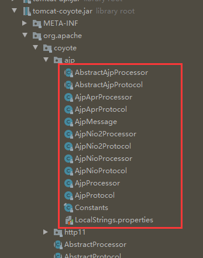
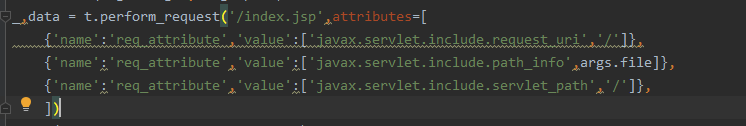
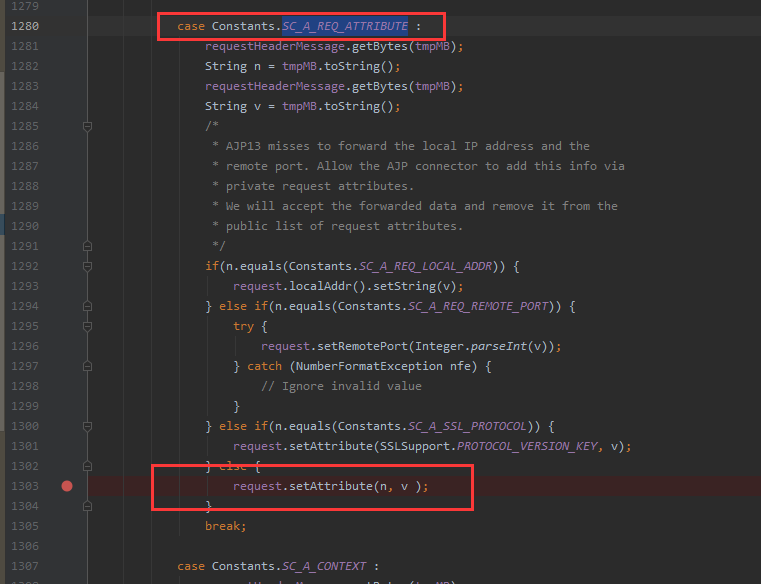
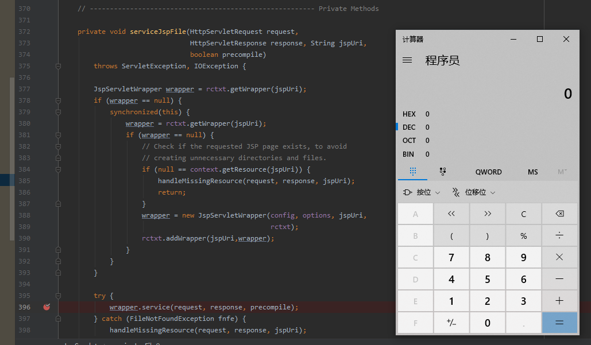

CVE-2020-1938:Tomcat AJP文件包含漏洞分析
--

### 0x01 前言

最近这个漏洞特别的火，各大媒体都在报道，在第一时间进行复现过后，我就想着找个时间分析分析，但是看了老半天的代码也没找到漏洞的触发点，只是根据PoC确定了是由于ajp协议可以自定义request的某些属性值导致的漏洞，而且我翻源码也找到了ajp协议的逻辑代码。但是更进一步，就卡住了，不知道自定义属性怎么就导致了漏洞的产生~没办法，只有去看看别的师傅的分析文章，恍然大悟，原来经过我们自定义属性过后的request对象的后续处理依旧符合tomcat的处理流程，就是针对某个地址的请求会被预先设置好的servlet处理，而任意文件包含也就出现在这些servlet中。下面我们就来看下具体的代码吧

### 0x02 漏洞分析

在分析之前我们还需要了解一下ajp协议的作用。移步： https://blog.csdn.net/jeikerxiao/article/details/82745516

我翻了下tomcat的源码，发现ajp协议实现在下面这一堆源码里：



然后我把这几个文件都翻了一遍，确定了几个可疑的文件以及可疑的函数，那么怎么确定我们的怀疑是否正确呢？只有下断点，然后发送payload,看看是否能够触发断点23333。结合网上公开的poc



可以看到是设置了几个属性的，而且name是req_attrubute,然后我就去ajp协议源码中去找对这些属性进行处理的部分，一顿操作猛如虎，反正就是反复的调试，最后确定到prepareRequest这个方法，而且这个方法中可以看到这么一段代码：



经过几次调试，最终确定这里就是设置request属性的地方了，但是设置了request属性过后，request对象又会怎么被处理呢？我就是一直卡在这里了，当然，后面看到师傅的文章，知道请求会发送到对应的servlet，如果我们请求的是一个jsp文件，根据tomcat的默认web.xml文件：

```xml
    <servlet>
        <servlet-name>jsp</servlet-name>
        <servlet-class>org.apache.jasper.servlet.JspServlet</servlet-class>
        <init-param>
            <param-name>fork</param-name>
            <param-value>false</param-value>
        </init-param>
        <init-param>
            <param-name>xpoweredBy</param-name>
            <param-value>false</param-value>
        </init-param>
        <load-on-startup>3</load-on-startup>
    </servlet>
```

可以看到是被JspServlet处理了，会执行到JspServlet的service方法：

```java
    public void service (HttpServletRequest request,
                             HttpServletResponse response)
                throws ServletException, IOException {

        //jspFile may be configured as an init-param for this servlet instance
        String jspUri = jspFile;

        if (jspUri == null) {
            // JSP specified via <jsp-file> in <servlet> declaration and
            // supplied through custom servlet container code
            String jspFile = (String) request.getAttribute(Constants.JSP_FILE);
            if (jspFile != null) {
                jspUri = jspFile;
                request.removeAttribute(Constants.JSP_FILE);
            }
        }
        if (jspUri == null) {
            /*
             * Check to see if the requested JSP has been the target of a
             * RequestDispatcher.include()
             */
            jspUri = (String) request.getAttribute(
                    RequestDispatcher.INCLUDE_SERVLET_PATH);
            if (jspUri != null) {
                /*
                 * Requested JSP has been target of
                 * RequestDispatcher.include(). Its path is assembled from the
                 * relevant javax.servlet.include.* request attributes
                 */
                String pathInfo = (String) request.getAttribute(
                        RequestDispatcher.INCLUDE_PATH_INFO);
                if (pathInfo != null) {
                    jspUri += pathInfo;
                }
            } else {
                /*
                 * Requested JSP has not been the target of a
                 * RequestDispatcher.include(). Reconstruct its path from the
                 * request's getServletPath() and getPathInfo()
                 */
                jspUri = request.getServletPath();
                String pathInfo = request.getPathInfo();
                if (pathInfo != null) {
                    jspUri += pathInfo;
                }
            }
        }

        if (log.isDebugEnabled()) {
            log.debug("JspEngine --> " + jspUri);
            log.debug("\t     ServletPath: " + request.getServletPath());
            log.debug("\t        PathInfo: " + request.getPathInfo());
            log.debug("\t        RealPath: " + context.getRealPath(jspUri));
            log.debug("\t      RequestURI: " + request.getRequestURI());
            log.debug("\t     QueryString: " + request.getQueryString());
        }

        try {
            boolean precompile = preCompile(request);
            serviceJspFile(request, response, jspUri, precompile);
        } catch (RuntimeException e) {
            throw e;
        } catch (ServletException e) {
            throw e;
        } catch (IOException e) {
            throw e;
        } catch (Throwable e) {
            ExceptionUtils.handleThrowable(e);
            throw new ServletException(e);
        }

    }
```

经过上面代码的处理，最终jspUri的值变成了`javax.servlet.include.servlet_path + javax.servlet.include.path_info`，而这两个属性的值都是我们可控的。然后jspUri传入了serviceJspFile方法，也就是把jspUri指定的文件当作jsp文件解析了，所以能够造成RCE。




而如果我们构造一个请求普通文件的ajp请求，tomcat最终根据web.xml中的配置调用DefaultServlet处理，也会造成LFI漏洞。具体就不分析了


### 0x03 其他

参考： https://www.colabug.com/2020/0222/7029362/

这篇文章写的比较水，主要是能写的并不多，其实就是通过ajp协议向tomcat发送请求包是可以控制request对象的`javax.servlet.include.request_uri, javax.servlet.include.path_info, javax.servlet.include.servlet_path` 这三个关键属性，导致我们可以访问任意的文件。

阅读本文需要结合PoC，因为很多线索都在PoC中： https://github.com/YDHCUI/CNVD-2020-10487-Tomcat-Ajp-lfi/blob/master/CNVD-2020-10487-Tomcat-Ajp-lfi.py


